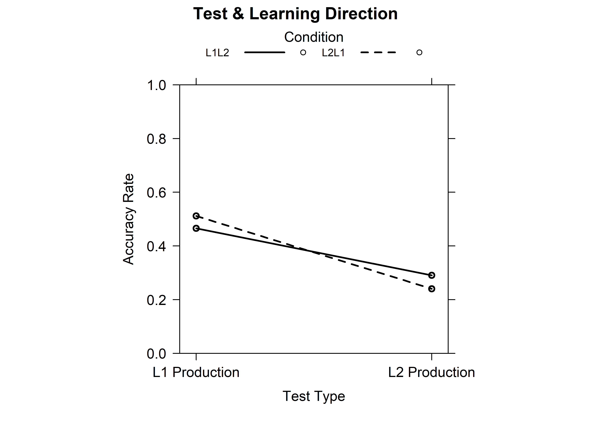

# Chapter overview {.unnumbered}

This chapter aims to reproduce key analyses published in:

-   Terai, Masato, Junko Yamashita, and Kelly E. Pasich. 2021. EFFECTS
    OF LEARNING DIRECTION IN RETRIEVAL PRACTICE ON EFL VOCABULARY
    LEARNING. Studies in Second Language Acquisition 43(5): 1116–1137.
    <https://doi.org/10.1017/S0272263121000346>.

Based on the original data from @2021, we will show how `R` can be used
in Second Language Acquisition (SLA) research. This chapter will walk
you through how to:

-   Retrieve the authors' original data and import it in `R`
-   Calculate descriptive statistics concerning target items, test
    types, and alpha coefficients for tests
-   Reproduce Tables 3, 4 and 5 from @2021
-   Fit a generalized linear mixed-effects model to investigate the
    effectiveness of learning direction
-   Compare models with and without interactions
-   Fit a generalized linear mixed-effects model to explore the
    influence of L2 proficiency on the two types of learning
-   Interpret and compare the results with those printed in Terai et al.
    [-@2021]
-   Visualize the results with different kinds of plots to facilitate
    interpretation

By the end of this chapter, you will have experience of fitting and
interpreting mixed-effects logistics regression models in `R` on
experimental data.

# Introducing the study

In this chapter, we attempt to reproduce the results of an SLA study by
Terai et al. [-@2021]. The study focuses on learning directions in
pair-associated vocabulary learning: L2 to L1, where L2 words are used
as stimuli and responses are given in L1, vs. L1 to L2, where it is the
other way around. As opposed to studying practices where both a target
and the answer are simultaneously presented, pair-associated learning
involves *retrieval*. Retrieval is defined as the process of accessing
stored information and plays a crucial role in retaining a learned word
in memory [@2021: 1116-1117]. Previous findings regarding the efficacy
of the two types of learning directions are inconsistent. The study that
we will reproduce focuses on the relationship between L2 proficiency and
the effectiveness of the two learning directions in paired-associate
learning in L2 vocabulary acquisition. It aims to answer two research
questions:

1.  Which learning direction is more effective for vocabulary
    acquisition, L1 to L2 learning or L2 to L1 learning?
2.  How does L2 proficiency influence the effects of L2 to L1 and L1 to
    L2 learning?

To answer these questions, @2021 designed an experiment in which
Japanese EFL (English as a Foreign Language) learners studied word pairs
and then completed retrieval practice tasks in different conditions.
After learning, students were tested on their ability to produce the
target vocabulary items in both Japanese (their L1) and English (their
L2). @2021 formulated two hypotheses:

1.  There is no significant difference between the two learning
    directions.
2.  The effect of the learning direction depends on the learner’s L2
    proficiency [@2021: 1121-1122].

# Retrieving the original data

We will use the study's original data for our reproduction, which Terai
et al. have made openly accessible on IRIS, a free database for language
research:

-   [Terai, M., Yamashita, J. & Pasich, K. E. (2021). Effects of
    Learning Direction in Retrieval Practice on EFL Vocabulary Learning.
    Studies in Second Language Acquisition. 43(5).
    1116–1137)](https://www.iris-database.org/search/?s_publicationAPAInlineReference=Terai%20et%20al.%20(2021))

In this particular case, the authors have not only made their research
data available, but also their `R` code. Our reproduction will examine
and run this `R` code to investigate and interpret the statistical
analysis and results presented in the original publication.

The dataset (`dataset1_ssla_20210313.csv`) contains data for each
participant and item, including the variables:

-   **Answer** (whether the participant gave the correct answer (1 =
    correct, 0 = incorrect))
-   **Test** (distinguishing the two test types: L1 Production or L2
    Production)
-   **Condition** (distinguishing the two learning directions: L2 -\> L1
    or L1 -\> L2), etc.

But more on that later.

# Setup and importing the data

Before importing the dataset and starting on our project, we need to
load all the packages that we will need. Some of these packages may have
to be installed first using the `install.packages()` command in your
console.


::: {.cell}

```{.r .cell-code}
# This chunk loads necessary libraries.

# Load libraries
library(here) 
library(tidyverse)
```
:::


Next, we can import the data. In contrast to the code from @2021, we
used the {here} package for importing the data. This package creates
paths relative to the top-level directory and therefore makes it easier
to reference files regardless of how they are organized inside a
project. Following the code in @2021, the test type (`Test`) and the
learning direction (`Condition`) are declared as factor variables as
these variables represent categories rather than numerical values.
Converting the variables into factors now will also be useful for the
statistical analysis such as an ANOVA (Analysis of Variance), which will
be conducted later.

In a later step the command `trimws()` will be used, which removes space
from the beginning and end of the text. This helps to prevent issues
like "berth " vs. "berth" being treated as different.


::: {.cell}

```{.r .cell-code}
VocabularyA_L1production <- read.csv(file = here("data", "vocaA_L1pro_20210313.csv"))
VocabularyA_L2production <- read.csv(file = here("data", "vocaA_L2pro_20210313.csv"))
VocabularyB_L1production <- read.csv(file = here("data", "vocaB_L1pro_20210313.csv"))
VocabularyB_L2production <- read.csv(file = here("data", "vocaB_L2pro_20210313.csv"))

# Loading the dataset
dat <- read.csv(file = here("data", "dataset1_ssla_20210313.csv"), header=T)

# Converting the categorical variables to factors using the function as.factor()
dat$Test <- as.factor(dat$Test)
dat$Condition <- as.factor(dat$Condition)
```
:::


Before fitting the models, @2021 also apply **contrast coding**, also
called **treatment coding** [@1992]. While it may
look confusing and maybe intimidating, it is actually quite an important
step. Basically, the study aims to compare two groups (L1 -\> L2 vs. L2
-\> L1). @2021 use **simple coding**, where the first Condition (L1 -\>
L2) gets coded as -0.5 and the second Condition (L2 -\> L1) as +0.5.
This makes interpretations easier when there are interactions since the
intercept represents the overall mean across conditions [@2022].


::: {.cell}

```{.r .cell-code}
c <- contr.treatment(2)
my.coding <- matrix(rep(1/2, 2, ncol = 1))
my.simple <- c-my.coding
print(my.simple)
```

::: {.cell-output .cell-output-stdout}

```
     2
1 -0.5
2  0.5
```


:::

```{.r .cell-code}
contrasts(dat$Test) <- my.simple
contrasts(dat$Condition) <- my.simple

# Standardizing vocabulary scores (centered and scaled)
dat$s.vocab <- scale(dat$Vocab)
```
:::


All these steps set up the dataset for modeling. Converting variables to
factors and coding them with contrast ensures that they are interpreted
correctly in the regression. Scaling the vocabulary scores helps with
interaction terms.

Standardizing our variables is an important step for as since it is very
useful when variables are measured on different scales or when you want
to compare them in a fair way. Also, there are some statistical mdels
that work better when predictors are standardized.

# Descriptive statistics

Before we dive into the descriptive statistics conducted in @2021, we
need to explain that one part of it will not be reproduced. While
descriptive statistics about the participants (age, years of learning,
etc.) are mentioned in the paper by Terai et al. [-@2021], we were not
able to find the data to reproduce these findings. It is neither part of
the dataset accessible on IRIS, nor does it come up anywhere in the
authors' R code. Although, it is common that participant data is not
available to protect their identities. Therefore, we will only focus on
reproducing the descriptive statistics of the target items (40 English
words used in the study), test types and reliability testing. We'll
start with the target items, which are found in Table 3 in the paper
[@2021: 1123].

Most of the statistics reproduced here are things we are already
familiar with: the mean, median, maximum and minimum, as well as the
standard deviation (SD). In addition, @2021 reported skewness and
kurtosis.

**Skewness** and **kurtosis** are both measures of shapes and
distribution of a dataset in qualitative methods. Skewness measures the
asymmetry of distribution. Simply put, it describes the amount of which
the distribution differs from a completely symmetric shape [@2023]:

-   Skew = 0 -\> perfectly symmetrical.
-   Negative Skew -\> longer "tail" on the left.
-   Positive Skew -\> longer "tail" on the right.

Kurtosis then is a measure of peaks of a distribution. Basically, it is
a description of how the peaks compare to a normal distribution
[@2023]:

-   Kurtosis = 0 -\> similar to a normal distribution.
-   Positive kurtosis -\> sharper peak (more concentrated in the
    center).
-   Negative kurtosis -\> flatter peak. [@2023]

## Reproduction of Table 3

In this section, our aim is to reproduce Table 3 from @2021, which displays the descriptive statistics of the target items
of the study. Unfortunately, the code for all the tables shown in @2021
was not included in the published R code. But since we have the data in
the form of a `.csv` file, this is not a problem! We have the organized
data ready for us to analyze. Thus, we will learn how to reproduce the
data of Table 3 step-by-step.

We have already loaded the data that we will need for this table, but
just to be sure, we will do it again and also load all the necessary
libraries for the two tables, so we have some kind of "toolbox" that
contains every function we might need:


::: {.cell}

```{.r .cell-code}
# Load libraries (packages need to be installed if they aren't already)

library(moments) #for skewness and kurtosis
library(knitr) #for nice tables
library(kableExtra) #for nicer tables

# Load data again which was provided in the IRIS repository
dat <- read.csv(file = here("data", "dataset1_ssla_20210313.csv"), header = TRUE)

dat$ItemID <- trimws(dat$ItemID)
```
:::


In the paper by Terai et al. [-@2021] we can see that the variables used
are, for L2-related variables: Frequency, Syllables, and Letters. For
L1-related variables: Frequency, Letters, and Mora (syllables) as well
as Familiarity (Fami A). We were not able to reproduce Fami (B) as the
data was not made public. Also, important to note: "L1 frequency and L1
familiarity were retrieved from Amano and Kondo [-@2000]" [@2021: 1123].

First, we need to take a look at the data that the authors have made
available. The column names may differ from what we want to see in the
table later on, which is why we briefly want to check them by having
them printed in a nice table with descriptions of their meanings:


::: {#tbl-descriptives .cell tbl-cap='Description of the Dataset Variables'}

```{.r .cell-code}
var_info <- data.frame(
  Column = c("ItemID", "L2Frequency", "Syllables", "Alphabet", "L1Frequency", "WordLength", "mora", "Familiarity"),
  Description = c(
    "English target word (40 items)",
    "Frequency of the word in English (COCA: Corpus of Contemporary American English)",
    "Number of syllables in the English word",
    "Number of letters in the English word ('Letters' in the L2 table)",
    "Frequency of the word in Japanese (Amano & Kondo, 1999)",
    "Number of letters in the Japanese orthographic form",
    "Number of mora (Japanese syllable-like units)",
    "Familiarity ratings from current study (Fami (B))"
  )
)

kable(var_info) %>%
  kable_styling(full_width = FALSE, position = "center")
```

::: {.cell-output-display}
`````{=html}
<table class="table" style="width: auto !important; margin-left: auto; margin-right: auto;">
 <thead>
  <tr>
   <th style="text-align:left;"> Column </th>
   <th style="text-align:left;"> Description </th>
  </tr>
 </thead>
<tbody>
  <tr>
   <td style="text-align:left;"> ItemID </td>
   <td style="text-align:left;"> English target word (40 items) </td>
  </tr>
  <tr>
   <td style="text-align:left;"> L2Frequency </td>
   <td style="text-align:left;"> Frequency of the word in English (COCA: Corpus of Contemporary American English) </td>
  </tr>
  <tr>
   <td style="text-align:left;"> Syllables </td>
   <td style="text-align:left;"> Number of syllables in the English word </td>
  </tr>
  <tr>
   <td style="text-align:left;"> Alphabet </td>
   <td style="text-align:left;"> Number of letters in the English word ('Letters' in the L2 table) </td>
  </tr>
  <tr>
   <td style="text-align:left;"> L1Frequency </td>
   <td style="text-align:left;"> Frequency of the word in Japanese (Amano &amp; Kondo, 1999) </td>
  </tr>
  <tr>
   <td style="text-align:left;"> WordLength </td>
   <td style="text-align:left;"> Number of letters in the Japanese orthographic form </td>
  </tr>
  <tr>
   <td style="text-align:left;"> mora </td>
   <td style="text-align:left;"> Number of mora (Japanese syllable-like units) </td>
  </tr>
  <tr>
   <td style="text-align:left;"> Familiarity </td>
   <td style="text-align:left;"> Familiarity ratings from current study (Fami (B)) </td>
  </tr>
</tbody>
</table>

`````
:::
:::


In @tbl-descriptives we can see that there are eight variables included
in the dataset which are all crucial for the study by @2021.

Basically, what we are doing next is shaping our data from
participant-focused to item-focused. The raw dataset has multiple rows
per word because each participant contributed several responses and thus
has their own row per word. For example, the word "weasel" appears many
times, once for each participant. But for descriptive statistics of the
items, we only want one row per word.

To solve this issue we use the `commands group_by()` and `summarise()`
to turn all those rows into just a single one per word. The command
`group_by(ItemID)` we use in the code groups all rows together that
contain the same word. The function `summarise()` then creates our new
dataset by calculating the information everything we need and want to
look at, so L2Frequency, Syllables, Alphabet, etc. The function
`first()` is fairly simple, since the frequencies, syllables etc. of the
words do not change, we just take the first occurence without any
repetition. Only for the familiarity ratings we calculated the `mean()`
across all participants for each word.


::: {.cell}

```{.r .cell-code}
items <- dat |>
  group_by(ItemID) |>
  summarise(
    L2Frequency = first(L2Frequency),
    Syllables = first(Syllables),
    Alphabet = first(Alphabet),
    L1Frequency = first(L1Frequency),
    WordLength = first(WordLength),
    mora = first(mora),
    familiarity = mean(familiarity, na.rm = TRUE), 
    .groups = "drop"
  )
```
:::


A quick check before we continue, we expect 40 items in total so this
command should print 40:


::: {.cell}

```{.r .cell-code}
nrow(items)
```

::: {.cell-output .cell-output-stdout}

```
[1] 40
```


:::
:::


In order to avoid repeating code (and because we are lazy), we create
our own function that computes all the statistics (mean, SD, median,
min, max, skew, kurtosis) we need for each variable. We build our own
small machine that we will name `quick_stats()`, it will do the
calculations for us. `quick_stats \<- funcion(x)` creates this function
with the input 'x' which represents whichever variable we want to
analyze. Inside of our function, we use `data.frame()` for organization
of our statistics before we begin the calculations. Each calculation
takes our input variable 'x' and computes the statistics. The functions
`skewness()` and `kurtosis()` come from the {moments} package we loaded
earlier.


::: {.cell}

```{.r .cell-code}
quick_stats <- function(x) {
  data.frame(
    Mean = mean(x, na.rm = TRUE),
    SD = sd(x, na.rm = TRUE),
    Median = median(x, na.rm = TRUE), 
    Minimum = min(x, na.rm = TRUE),
    Maximum = max(x, na.rm = TRUE),
    Skew = skewness(x, na.rm = TRUE),
    Kurtosis = kurtosis(x, na.rm = TRUE)
    )
}
```
:::


Now that we have most of what we need for the tables, we can start to
build them up! There are two subtables we need.

The code below does this with two important functions: `rbind()` which
stacks the rows we want to create on top of each other to build the
final table which we will print in the next step. And `cbind()` which
creates columns that stick together side by side. For example
`cbind(Variable = "Frequency", desc(items\$L2Frequency)` creates a
column with the name "Variable" with the value "Frequency" next to the
summary of the output of `quick_stats()`. With our helper function
`desc()` we then insert the the statistics from our data, in this case
it is the "L2Frequency". Basically, we are creating here three rows
stacked on top of each other for tab_L2, and four rows for tab_L1. As
you see we only have to run our helper function `quick_stats()` seven
times!


::: {.cell}

```{.r .cell-code}
tab_L2 <- rbind(
  cbind(Variable = "Frequency", quick_stats(items$L2Frequency)),
  cbind(Variable = "Syllables", quick_stats(items$Syllables)),
  cbind(Variable = "Letters", quick_stats(items$Alphabet))
)

tab_L1 <- rbind(
  cbind(Variable = "Frequency", quick_stats(items$L1Frequency)),
  cbind(Variable = "Letters", quick_stats(items$WordLength)),
  cbind(Variable = "Mora (syllables)", quick_stats(items$mora)),
  cbind(Variable = "Fami (A)", quick_stats(items$familiarity))
)
```
:::


Great! You are almost done building the table for the descriptive
statistics. In the next step, we will round the numbers to two decimals
to make the table actually readable.


::: {.cell}

```{.r .cell-code}
tab_L2$Mean     <- round(tab_L2$Mean, 2)
tab_L2$SD       <- round(tab_L2$SD, 2)
tab_L2$Median   <- round(tab_L2$Median, 2)
tab_L2$Minimum  <- round(tab_L2$Minimum, 2)
tab_L2$Maximum  <- round(tab_L2$Maximum, 2)
tab_L2$Skew     <- round(tab_L2$Skew, 2)
tab_L2$Kurtosis <- round(tab_L2$Kurtosis, 2)

tab_L1$Mean     <- round(tab_L1$Mean, 2)
tab_L1$SD       <- round(tab_L1$SD, 2)
tab_L1$Median   <- round(tab_L1$Median, 2)
tab_L1$Minimum  <- round(tab_L1$Minimum, 2)
tab_L1$Maximum  <- round(tab_L1$Maximum, 2)
tab_L1$Skew     <- round(tab_L1$Skew, 2)
tab_L1$Kurtosis <- round(tab_L1$Kurtosis, 2)
```
:::


Perfect, the next and easiest part of building up our two subtables is
captioning them and then finally printing them. Here we need the
`kable()` and the `kable_classic()` function. We use these functions to
make the tables look easy to read. The `kable()` function is quite nice
because it helps to make the R code output look a little more
professional. The function comes from the {knitr} package.
`kable(tab_L2, ...)` takes our tab_2 data frame and converts it into a
formatted table which we then caption with the command
`caption = "..."`. With the command `align = "lrrrrrr"` we control the
way the text is aligned in each column. the 'l' means left-aligned,
while every added "r" means the remaining columns should be
right-aligned. The `kable_classics()` function comes from the
{kableExtra} package we loaded earlier. It is also another function to
tidy up our table style. The command `full_width = FALSE` makes sure
that the table does not stretch too wide. When you run this code, you
will see a nice table with clear structure and formatting which will
make it easier to read and interpret, it also looks ready to be
published.


::: {#tbl-desc-stats1 .cell tbl-cap='Table 3a. Descriptive statistics for L2 (English) item properties.'}

```{.r .cell-code}
kable(tab_L2,
      align = "lrrrrrrr" ) |>
  kable_classic(full_width = FALSE)
```

::: {.cell-output-display}
`````{=html}
<table class=" lightable-classic" style='font-family: "Arial Narrow", "Source Sans Pro", sans-serif; width: auto !important; margin-left: auto; margin-right: auto;'>
 <thead>
  <tr>
   <th style="text-align:left;"> Variable </th>
   <th style="text-align:right;"> Mean </th>
   <th style="text-align:right;"> SD </th>
   <th style="text-align:right;"> Median </th>
   <th style="text-align:right;"> Minimum </th>
   <th style="text-align:right;"> Maximum </th>
   <th style="text-align:right;"> Skew </th>
   <th style="text-align:right;"> Kurtosis </th>
  </tr>
 </thead>
<tbody>
  <tr>
   <td style="text-align:left;"> Frequency </td>
   <td style="text-align:right;"> 1025.33 </td>
   <td style="text-align:right;"> 851.93 </td>
   <td style="text-align:right;"> 813.5 </td>
   <td style="text-align:right;"> 51 </td>
   <td style="text-align:right;"> 3930 </td>
   <td style="text-align:right;"> 1.51 </td>
   <td style="text-align:right;"> 5.21 </td>
  </tr>
  <tr>
   <td style="text-align:left;"> Syllables </td>
   <td style="text-align:right;"> 2.00 </td>
   <td style="text-align:right;"> 0.91 </td>
   <td style="text-align:right;"> 2.0 </td>
   <td style="text-align:right;"> 1 </td>
   <td style="text-align:right;"> 5 </td>
   <td style="text-align:right;"> 0.84 </td>
   <td style="text-align:right;"> 4.06 </td>
  </tr>
  <tr>
   <td style="text-align:left;"> Letters </td>
   <td style="text-align:right;"> 6.22 </td>
   <td style="text-align:right;"> 1.75 </td>
   <td style="text-align:right;"> 6.0 </td>
   <td style="text-align:right;"> 3 </td>
   <td style="text-align:right;"> 12 </td>
   <td style="text-align:right;"> 0.97 </td>
   <td style="text-align:right;"> 4.52 </td>
  </tr>
</tbody>
</table>

`````
:::
:::


::: {#tbl-desc-stats2 .cell tbl-cap='Table 3b. Descriptive statistics for L1 (Japanese) item properties.'}

```{.r .cell-code}
kable(tab_L1,
      align = "lrrrrrrr") |>
  kable_classic(full_width = FALSE)
```

::: {.cell-output-display}
`````{=html}
<table class=" lightable-classic" style='font-family: "Arial Narrow", "Source Sans Pro", sans-serif; width: auto !important; margin-left: auto; margin-right: auto;'>
 <thead>
  <tr>
   <th style="text-align:left;"> Variable </th>
   <th style="text-align:right;"> Mean </th>
   <th style="text-align:right;"> SD </th>
   <th style="text-align:right;"> Median </th>
   <th style="text-align:right;"> Minimum </th>
   <th style="text-align:right;"> Maximum </th>
   <th style="text-align:right;"> Skew </th>
   <th style="text-align:right;"> Kurtosis </th>
  </tr>
 </thead>
<tbody>
  <tr>
   <td style="text-align:left;"> Frequency </td>
   <td style="text-align:right;"> 596.90 </td>
   <td style="text-align:right;"> 885.49 </td>
   <td style="text-align:right;"> 275.00 </td>
   <td style="text-align:right;"> 6.00 </td>
   <td style="text-align:right;"> 5109.00 </td>
   <td style="text-align:right;"> 3.59 </td>
   <td style="text-align:right;"> 18.10 </td>
  </tr>
  <tr>
   <td style="text-align:left;"> Letters </td>
   <td style="text-align:right;"> 3.67 </td>
   <td style="text-align:right;"> 1.07 </td>
   <td style="text-align:right;"> 4.00 </td>
   <td style="text-align:right;"> 1.00 </td>
   <td style="text-align:right;"> 6.00 </td>
   <td style="text-align:right;"> 0.17 </td>
   <td style="text-align:right;"> 3.48 </td>
  </tr>
  <tr>
   <td style="text-align:left;"> Mora (syllables) </td>
   <td style="text-align:right;"> 3.52 </td>
   <td style="text-align:right;"> 0.96 </td>
   <td style="text-align:right;"> 4.00 </td>
   <td style="text-align:right;"> 1.00 </td>
   <td style="text-align:right;"> 6.00 </td>
   <td style="text-align:right;"> 0.19 </td>
   <td style="text-align:right;"> 4.29 </td>
  </tr>
  <tr>
   <td style="text-align:left;"> Fami (A) </td>
   <td style="text-align:right;"> 5.22 </td>
   <td style="text-align:right;"> 0.64 </td>
   <td style="text-align:right;"> 5.36 </td>
   <td style="text-align:right;"> 3.72 </td>
   <td style="text-align:right;"> 6.38 </td>
   <td style="text-align:right;"> -0.63 </td>
   <td style="text-align:right;"> 2.83 </td>
  </tr>
</tbody>
</table>

`````
:::
:::


Our reproduced tables @tbl-desc-stats1 and @tbl-desc-stats2 now closely
match Table 3 in Terai et al. [-@2021]! The L2 frequency has a mean of
about 1025 with a quite large SD (\~852), which shows us that some
English words were quite frequent while others were much rarer. The
skewness here is positive (\~1.51), although slightly different than the
one reported in the paper (\~1.57). The difference is only small and
still shows that the distribution has a "long tail" of very
high-frequency words. Syllables in English have an average mean of 2,
and range from 1 to 5 with only a slight positive skewness which means
that most words are short and only a few are longer, again there is a
small difference in skewness. Letters average around 6.2 again with a
positive skewness. For the L1 variables, the frequency distribution also
shows a strong positive skew, which means that few Japanese translations
are very common, but many are quite rare. Fami (A)) averages about 5.2
on a 7-point scale, with a pretty low SD, suggesting that the words were
mostly familiar.

Our skewness values match the original paper closely, with only small
differences. However, our kurtosis values differ quite a lot from the
published results. This may seem like a huge issue at first, but is
actually quite normal. Kurtosis calculations can vary between packages,
for example the 'moments' package we used calculates excess kurtosis,
while the authors of the original paper might have used different
methods.

We tried several methods to reproduce the kurtosis values from the
original publication, but there seems to be an issue somewhere. We
calculated both the excess kurtosis and the pearson kurtosis (see in the
chunk below), but no numbers match the ones in the paper.


::: {.cell}

```{.r .cell-code}
excess_kurt <- kurtosis(dat$mora, na.rm = TRUE) #instead of mora any other Variable of table 3 can be added to calculate kurtosis
pearson_kurt <- excess_kurt + 3
round(c(excess = excess_kurt, pearson = pearson_kurt), 3)
```

::: {.cell-output .cell-output-stdout}

```
 excess pearson 
  4.285   7.285 
```


:::
:::


There are several possibilities why this is the case. There might be an
outlier that may have been removed, or maybe the authors used another
method. The issue with the differences in our numbers and the ones by
Terai et al. [-@2021] is that the differences are so big the graphs are
going to look quite different, especially for the Fami (A) variable. In
the paper the kurtosis shows -0.02 which would be a slightly flatter
graph, while our kurtosis number 4.29 would be sharper. This is why, in
an extension, we have added some graphs to show the importance of
skewness and kurtosis and what exactly these numbers show.

## Extension (Beyhan)

### Visualizations of Table 3

Table 3 shows a summary of many descriptive statistics (mean, SD, range,
skewness, kurtosis) for the 40 target words, but these numbers are much
easier to understand when they are visualized. Below we want to turn
some key variables of Table 3 into quick histograms to visually connect
the ideas of skew and kurtosis to the actual items used in this study.

Please note that in this extension our reloading of the data may seem
repetitive, but it simply ensures that this section can work on its own
if needed, but to you it is optional.


::: {.cell}

```{.r .cell-code}
# {tidyverse} library needs to be loaded if you have not done it before.

dat <- read.csv(file = here("data", "dataset1_ssla_20210313.csv"), header = TRUE)
dat$ItemID <- trimws(dat$ItemID)

items <- dat |>
  group_by(ItemID) |>
  summarise(
    L2Frequency  = first(L2Frequency),
    Syllables    = first(Syllables),
    Letters_L2   = first(Alphabet),
    L1Frequency  = first(L1Frequency),
    Letters_L1   = first(WordLength),
    Mora         = first(mora),
    Familiarity  = mean(familiarity, na.rm = TRUE),
    .groups = "drop"
  )

##if you want you can quickly check the item number with 'nrow(items)' it should be 40 for our 40 target items!
```
:::


We will start with a graph of L2 Frequencies. To do this we use the
`ggplot()` command. The first line of code here
`ggplot(data = items, aes(x = L2Frequency))` tells ggplot to basically
use the "items" dataset and put the L2 frequencies of each word onto the
x-axis. `geom_density(...)` creates the actual density plot. To fully
understand where the numbers in the table come from, we add reference
lines: `geom_vline(xintercept = mean(...))` for the mean value, and
`geom_vline(xintercept = median(...), linetype = "dashed"...)` for a
dashed line at the median.

Do not be too confused by the numbers on the y-axis. Since our focus
here is to see in the density plot what skewness and kurtosis are, our
curve simple shows the proportions on the x-axis. The values can be read
as a kind of probability, a higher peak means more words are around that
frequency, while a lower peak means fewer words around that frequency.


::: {.cell .fig-cap-location-bottom}

```{.r .cell-code}
ggplot(items, aes(x = L2Frequency)) +
  geom_density(fill = "lightblue") +
  geom_vline(xintercept = mean(items$L2Frequency), linewidth = 0.7) +
  geom_vline(xintercept = median(items$L2Frequency), linetype = "dashed", linewidth = 0.7) +
  scale_y_continuous(labels = scales::comma) +
  scale_x_continuous(labels = scales::comma) +
  labs(x = "L2 frequency (COCA)",
       y = "Probability") +
theme_minimal()
```

::: {.cell-output-display}
{#fig-plot1 width=2100}
:::
:::


In @fig-plot1 we can clearly see a right-skewed distribution which we
saw in the table with the positive skewness values (\~1.51). As you can
probably recall, a normally distributed graph would be a symmetric
curve, nothing asymmetric, which is exactly what we see with skewness.
This means most words are lower or medium frequency with only a few
really high-frequency words (see the long right tail). The mean sits to
the right of the median which is another characteristic of positive
skew. The number of our kurtosis (\~5.21) shows us the sharpness or
peakedness of our curve which you can see quite nicely when you compare
the graph for L2 frequency to the one for L1 frequency.

For that, we have to do the exact same for the L1 frequencies.


::: {.cell .fig-cap-location-bottom}

```{.r .cell-code}
ggplot(items, aes(x = L1Frequency)) +
  geom_density(fill = "lightblue") +
  geom_vline(xintercept = mean(items$L1Frequency), linewidth = 0.7) +
  geom_vline(xintercept = median(items$L1Frequency), linetype = "dashed", linewidth = 0.7) +
  scale_x_continuous(labels = scales::comma) +
  scale_y_continuous(labels = scales::comma) +
  labs(x = "L1 frequency",
       y = "Probability",
       caption = "Solid line = mean; dashed line = median") +
theme_minimal()
```

::: {.cell-output-display}
{#fig-plot2 width=2100}
:::
:::


Again, we see in @fig-plot2 that the right-skew is even stronger than
for L2 (skew \~3.59). This shows once again that most words are
lower-frequency, there are only very few high-frequency words. Here,
with a kurtosis number of \~18.10 we can see that with higher positive
numbers the peak becomes sharper and sharper.

## Descriptive statistics of the tests and reliability testing

In this chapter, we will attempt to reproduce the authors' descriptive
statistics regarding the two types of post-tests and calculate
Cronbach's α to estimate their reliability.

### Reliability analysis

To conduct reliability analysis, the {psych} package needs to be
installed and loaded.


::: {.cell}

```{.r .cell-code}
library(psych)
```
:::


To calculate Cronbach's alpha, @2021 used the `alpha()` function and
vocabulary scores of both L1 and L2 production sets. Here, we will only
show the code and output of the reliability analysis for Vocabulary A
scores of the L1 production dataset, as an example.


::: {.cell}

```{.r .cell-code}
# Vocabulary A (L1 production)

alpha(VocabularyA_L1production[,-1], warnings=FALSE)
```

::: {.cell-output .cell-output-stdout}

```

Reliability analysis   
Call: alpha(x = VocabularyA_L1production[, -1], warnings = FALSE)

  raw_alpha std.alpha G6(smc) average_r S/N   ase mean   sd median_r
      0.84      0.83    0.94       0.2   5 0.045 0.51 0.23     0.21

    95% confidence boundaries 
         lower alpha upper
Feldt     0.73  0.84  0.91
Duhachek  0.75  0.84  0.92

 Reliability if an item is dropped:
             raw_alpha std.alpha G6(smc) average_r S/N alpha se var.r med.r
Azalea            0.82      0.82    0.93      0.20 4.6    0.048 0.028  0.20
Berth             0.82      0.82    0.93      0.20 4.6    0.048 0.030  0.20
Billow            0.83      0.83    0.93      0.20 4.8    0.047 0.029  0.21
Bluff             0.83      0.83    0.93      0.20 4.8    0.047 0.028  0.21
Camphor           0.82      0.82    0.93      0.19 4.5    0.050 0.029  0.19
Cistern           0.83      0.83    0.94      0.21 5.0    0.045 0.030  0.22
Citadel           0.83      0.83    0.93      0.20 4.7    0.047 0.029  0.21
Fracas            0.83      0.83    0.94      0.21 4.9    0.046 0.030  0.22
Fuselage          0.83      0.83    0.93      0.21 4.9    0.046 0.030  0.21
Insurgent         0.82      0.82    0.93      0.20 4.6    0.048 0.029  0.21
Loach             0.83      0.82    0.93      0.20 4.7    0.047 0.031  0.21
Otter             0.83      0.83    0.93      0.20 4.8    0.047 0.029  0.21
Pail              0.82      0.82    0.93      0.20 4.6    0.048 0.030  0.20
Plateau           0.83      0.83    0.93      0.20 4.8    0.047 0.031  0.20
Plumage           0.83      0.83    0.93      0.20 4.8    0.047 0.030  0.21
Rudder            0.84      0.83    0.94      0.21 5.1    0.045 0.028  0.21
Shoal             0.82      0.82    0.93      0.20 4.7    0.048 0.031  0.20
Strait            0.82      0.82    0.93      0.19 4.5    0.049 0.030  0.20
Tuberculosis      0.84      0.84    0.94      0.22 5.4    0.043 0.026  0.22
Tympanum          0.83      0.83    0.94      0.21 5.0    0.045 0.030  0.21

 Item statistics 
              n raw.r std.r r.cor r.drop mean   sd
Azalea       28  0.59  0.59  0.59  0.527 0.75 0.44
Berth        28  0.59  0.59  0.58  0.517 0.68 0.48
Billow       28  0.50  0.49  0.48  0.411 0.54 0.51
Bluff        28  0.52  0.50  0.50  0.435 0.36 0.49
Camphor      28  0.67  0.66  0.66  0.604 0.36 0.49
Cistern      28  0.34  0.36  0.33  0.257 0.18 0.39
Citadel      28  0.53  0.53  0.53  0.455 0.25 0.44
Fracas       28  0.42  0.43  0.41  0.329 0.61 0.50
Fuselage     28  0.40  0.41  0.39  0.323 0.18 0.39
Insurgent    28  0.57  0.58  0.58  0.499 0.71 0.46
Loach        28  0.54  0.54  0.52  0.456 0.39 0.50
Otter        28  0.50  0.50  0.49  0.430 0.82 0.39
Pail         28  0.58  0.58  0.58  0.502 0.64 0.49
Plateau      28  0.47  0.48  0.46  0.395 0.25 0.44
Plumage      28  0.47  0.48  0.47  0.395 0.25 0.44
Rudder       28  0.36  0.34  0.31  0.256 0.50 0.51
Shoal        28  0.56  0.56  0.55  0.486 0.75 0.44
Strait       28  0.65  0.64  0.64  0.576 0.57 0.50
Tuberculosis 28  0.15  0.17  0.12  0.056 0.75 0.44
Tympanum     28  0.40  0.38  0.35  0.301 0.64 0.49

Non missing response frequency for each item
                0    1 miss
Azalea       0.25 0.75    0
Berth        0.32 0.68    0
Billow       0.46 0.54    0
Bluff        0.64 0.36    0
Camphor      0.64 0.36    0
Cistern      0.82 0.18    0
Citadel      0.75 0.25    0
Fracas       0.39 0.61    0
Fuselage     0.82 0.18    0
Insurgent    0.29 0.71    0
Loach        0.61 0.39    0
Otter        0.18 0.82    0
Pail         0.36 0.64    0
Plateau      0.75 0.25    0
Plumage      0.75 0.25    0
Rudder       0.50 0.50    0
Shoal        0.25 0.75    0
Strait       0.43 0.57    0
Tuberculosis 0.25 0.75    0
Tympanum     0.36 0.64    0
```


:::
:::


::: {.cell}

```{.r .cell-code  code-fold="true" code-summary="Show code for reliability analysis for the rest of the dataset"}
# Vocabulary A (L2 production)

alpha(VocabularyA_L2production[,-1], warnings = FALSE)

# Vocabulary B (L1 production)

alpha(VocabularyB_L1production[,-1], warnings = FALSE)

# Vocabulary B (L2 production)

alpha(VocabularyB_L2production[,-1], warnings = FALSE)
```
:::


These reliability analyses compute Cronbach’s α, a measure of internal
consistency of tests. It indicates whether responses are consistent
between items. Before interpreting these results, we will get to the
descriptive statistics of the two types of post-tests, which the
reliability analyses are in regard to.

### Accuracy

To investigate accuracy, @2021 processed the collected results for each
participant — their ID, how many items they answered, and how many they
got right — and visualized them in a boxplot. Looking at the original
code from Terai et al., they loaded the dataset for this section again
and saved it under a different name `dat.acc`. Since it is not good
practice to load the data multiple times, we skipped that step and
simply used `dat` (which was saved as a variable already) instead.

The following code chunk, referring to L2 -\> L1 of the L1 production
set, processes the results for each participant — their ID, answered
items, correct answers — and puts them into a clean table. Therefore, it
gives us the core numbers necessary to describe and analyze accuracy.


::: {.cell}

```{.r .cell-code}
# L2 → L1 (L1 production test)

ids <- data.frame(unique(dat$ID))
names(ids) <- ("id")
z <- ids$id
Score <- c()
IDes <- c()
try <- c()
for (i in z){
  dat%>%
    dplyr::filter(ID == i, Condition == "L2L1", Test == "L1 Production")%>%
    dplyr::select(Answer) -> acc_recT
  a <- as.vector(unlist(acc_recT))
  b <- sum(a)
  c <- length(a)
  Score <- c(Score, b)
  IDes <- c(IDes, i)
  try <- c(try, c)
}

accu_L2L1_L1Pro <- data.frame(IDes, try, Score)
names(accu_L2L1_L1Pro) <- c("ID", "Try", "Score")
accu_L2L1_L1Pro
```

::: {.cell-output .cell-output-stdout}

```
   ID Try Score
1   3  19     9
2  11  20    17
3  22  15     9
4   1  20     6
5  17  20     7
6  28  17    12
7   8  18     4
8  10  18     4
9  16  19     5
10  5  19    17
11 21  20     9
12 23  18    16
13  4  19     9
14 27  20    11
15  6  17     6
16  7  20     8
17 15  18    15
18 12  20     9
19 20  20    18
20 24  20    10
21 14  19     4
22 26  20     7
23 25  20     6
24 18  20    12
25  9  20    13
26  2  20    12
27 13  20    11
28 19  20     6
```


:::
:::


We want to take the time to explain this part of Terai et al.'s code in
detail. The first line takes unique IDs from `dat` and wraps them into a
data frame called `ids`. The column is then named `id` using the
`names()` function. In the next step, it is extracted as a vector,
meaning that `z` is a vector of unique IDs. Further, a `for` loop is
used to iterate over elements of this vector and assigning the IDs to
the variable `i`. Inside this loop, for each `i` (a unique ID) the data
is filtered for that participant under certain conditions, and then the
Answer column is selected. The result is stored as the object
`acc_recT`, which is further converted into a vector `a`. With `b` and
`c`, the processed answers are computed and lastly, these results are
appended into three vectors: `Score`, `IDes`, and `try`. These three
vectors are combined into a final data frame `accu_L2L1_L1Pro`, where
each vector becomes a column in a table, each row corresponding to one
participant. These columns are renamed and the table is printed. If we
want to properly see the table outside of the console, we can use the
`View()` function:


::: {.cell}

```{.r .cell-code}
View(accu_L2L1_L1Pro)
```
:::


For L1 -\> L2 of the L1 production set, we follow the same steps.


::: {.cell}

```{.r .cell-code  code-fold="true" code-summary="Show code for L1 -> L2 (L1 production test)"}
# L1 → L2 (L1 production test)

ids <- data.frame(unique(dat$ID))
names(ids) <- ("id")
z <- ids$id
Score <- c()
IDes <- c()
try <- c()
for (i in z){
  dat%>%
    dplyr::filter(ID == i, Condition =="L1L2", Test == "L1 Production")%>%
    dplyr::select(Answer)-> acc_recT
  a <- as.vector(unlist(acc_recT))
  b <- sum(a)
  c <- length(a)
  Score <- c(Score, b)
  IDes <- c(IDes, i)
  try <- c(try, c)
}

accu_L1L2_L1Pro <- data.frame(IDes, try, Score)
names(accu_L1L2_L1Pro) <- c("ID", "Try", "Score")
accu_L1L2_L1Pro
```
:::


While accuracy did not play a very big role in @2021, the authors did a
bit more with it in their code. Aside from using the `describe()`
function on the final data frames, which returns a rich set of stats,
they visualized the results in a boxplot. Since we found them to be
quite nice for understanding the descriptive statistics of the tests, we
decided to include the boxplots.


::: {.cell}

```{.r .cell-code  code-fold="true" code-summary="Show use of describe() function on Score column to provide descriptive statistics for L1 production"}
# L2 → L1 learning
describe(accu_L2L1_L1Pro$Score)

# L1 → L2 learning
describe(accu_L1L2_L1Pro$Score)
```
:::


To visualize descriptive statistics for the L1 production set, Terai et
al. created a boxplot comparing the two learning directions. For this to
work, the beeswarm package has to be installed and loaded. Terai et al.
assigned a data frame `L1pro` that contains the scores from both
learning directions in the L1 production test. After changing the names
of the columns to how they shall appear on the x-axis, they created a
side-by-side boxplot for the learning conditions. Finally, they added
the `beeswarm()` function specifying `add = T`, which lets individual
scores appear as jittered dots that don't overlap.


::: {.cell .fig-cap-location-bottom}

```{.r .cell-code}
# Plot (L1 production)

library(beeswarm)

L1pro <- data.frame(accu_L2L1_L1Pro$Score,accu_L1L2_L1Pro$Score)
names(L1pro) <- c("L2 → L1 learning", "L1 → L2 learning")
boxplot(L1pro, col = "grey91", outline = T)
beeswarm(L1pro, add = T)
```

::: {.cell-output-display}
{#fig-L1-prod width=2100}
:::
:::


Boxplots are a way to visualize both the central tendency (median) of a
variable and the spread around this central tendency (IQR). The median
is represented by the thick line inside the box, while the box
represents interquartile range, meaning the range of the middle 50% of
the data. The whiskers outside the box extend to the highest and
smallest values, and the jittered dots represent individual data points.
As we can see here, the median is similar in both learning directions.
L2 → L1 displays slightly greater variability and a higher concentration
of upper outliers. Overall, performance appears comparable between the
two groups.

The same steps were applied to the L2 production set, simply using L2
scores:


::: {.cell}

```{.r .cell-code}
# L2 → L1 (L2 production test)

ids <- data.frame(unique(dat$ID))
names(ids) <- ("id")
z <- ids$id
Score <- c()
IDes <- c()
try <- c()
for (i in z){
  dat%>%
    dplyr::filter(ID == i, Condition == "L2L1", Test == "L2 Production")%>%
    dplyr::select(Answer) -> acc_proT
  a <- as.vector(unlist(acc_proT))
  b <- sum(a)
  c <- length(a)
  Score <- c(Score, b)
  IDes <- c(IDes, i)
  try <- c(try, c)
}

accu_L2L1_L2Pro <- data.frame(IDes, try, Score)
names(accu_L2L1_L2Pro) <- c("ID", "Try", "Score")
accu_L2L1_L2Pro
```

::: {.cell-output .cell-output-stdout}

```
   ID Try Score
1   3  19     5
2  11  20     8
3  22  15     4
4   1  20     3
5  17  20     3
6  28  17     8
7   8  18     3
8  10  18     3
9  16  19     2
10  5  19    12
11 21  20     8
12 23  18    11
13  4  19     0
14 27  20     2
15  6  17     6
16  7  20     5
17 15  18     5
18 12  20     8
19 20  20    13
20 24  20    10
21 14  19     2
22 26  20     1
23 25  20     2
24 18  20    10
25  9  20     7
26  2  20     7
27 13  20     6
28 19  20     4
```


:::
:::


::: {.cell}

```{.r .cell-code}
# L1 → L2 (L2 production test)

ids <- data.frame(unique(dat$ID))
names(ids) <- ("id")
z <- ids$id
Score <- c()
IDes <- c()
try <- c()
for (i in z){
  dat%>%
    dplyr::filter(ID == i, Condition == "L1L2", Test == "L2 Production")%>%
    dplyr::select(Answer)-> acc_proT
  a <- as.vector(unlist(acc_proT))
  b <- sum(a)
  c <- length(a)
  Score <- c(Score, b)
  IDes <- c(IDes, i)
  try <- c(try, c)
}

accu_L1L2_L2Pro <- data.frame(IDes,try, Score)
names(accu_L1L2_L2Pro) <- c("ID", "Try", "Score")
accu_L1L2_L2Pro
```

::: {.cell-output .cell-output-stdout}

```
   ID Try Score
1   3  20     9
2  11  19     9
3  22  17    10
4   1  20     0
5  17  20     5
6  28  20    11
7   8  19     1
8  10  20     2
9  16  20     5
10  5  18     9
11 21  20     6
12 23  15     7
13  4  20     8
14 27  20     1
15  6  18     6
16  7  19     6
17 15  19     9
18 12  20    13
19 20  20     8
20 24  19     4
21 14  20     5
22 26  18     6
23 25  20     1
24 18  19     6
25  9  19    13
26  2  20    10
27 13  20     5
28 19  20     4
```


:::
:::


::: {.cell}

```{.r .cell-code  code-fold="true" code-summary="Show use of describe() function on Score column to provide descriptive statistics for L2 production"}
# L2 -> L1 learning

describe(accu_L2L1_L2Pro$Score)

# L1 -> L2 learning

describe(accu_L1L2_L2Pro$Score)
```
:::


As with L1, Terai et al. [-@2021] created a similar boxplot comparing the two
learning directions in L2 production using the beeswarm package.


::: {.cell .fig-cap-location-bottom}

```{.r .cell-code}
# Plot (L2 production)

L2pro <- data.frame(accu_L2L1_L2Pro$Score, accu_L1L2_L2Pro$Score)
names(L2pro) <- c("L2 → L1 learning", "L1 → L2 learning")
boxplot(L2pro, col = "grey91", outline = T)
beeswarm(L2pro, add = T)
```

::: {.cell-output-display}
{#fig-L2-prod width=2100}
:::
:::


Median scores in the L2 production test are similar for both learning
directions (L2 → L1 and L1 → L2), suggesting comparable central
performance. L1 → L2 learning shows a slightly higher median. In the L2
→ L1 group, values below the median are more spread out, indicating more
variety. Comparing L1 and L2 production tests, L1 production scores
appear to be generally higher and more consistent across learning
directions.

### Reproducing Table 4 and 5

After conducting reliability testing and descriptive statistics for the
tests, we want to display the results in tables resembling Table 4 and 5
in [@2021: 1126]. As with the target items, there was no code accessible
for creating the tables. But with the available data, we can find a way
to reproduce them anyway!

First, we want to create a table that summarizes results of descriptive
statistics of tests, similar to Table 4 [@2021: 1126]. {knitr} and
{kableExtra} packages have to be loaded to proceed. As a first step, we
assign a variable that contains the scores for both datasets (L1 and L2
production) and use the `describe()` function to get all the important
measures.


::: {.cell}

```{.r .cell-code}
descriptive_stats_tests <- data.frame(L1pro, L2pro) |> 
  describe()
```
:::


In keeping with the table in the paper, the first two columns (number of
observations n = 28, and vars) are removed. Also, the rows are renamed
in a more readable way.


::: {.cell}

```{.r .cell-code}
descriptive_stats_tests_trimmed <- descriptive_stats_tests |> 
  select(-n, -vars, -trimmed, -mad, -range, -se)

rownames(descriptive_stats_tests_trimmed) <- c("L2 → L1 (L1pro)", "L1 → L2 (L1pro)", "L2 → L1 (L2pro)", "L1 → L2 (L2pro)")
```
:::


Now we want to display the results in a clean, formatted table using the
`kable()` function.


::: {#tbl-desc-stats-scores .cell .tbl-cap-location-top tbl-cap='Descriptive Statistics for Test Scores'}

```{.r .cell-code}
kable(descriptive_stats_tests_trimmed, 
      digits = 2) |> 
  pack_rows(index = c("L1 production test" = 2, "L2 production test" = 2)) |> 
  kable_styling(full_width = FALSE, bootstrap_options = c("striped", "hover"))
```

::: {.cell-output-display}
`````{=html}
<table class="table table-striped table-hover" style="width: auto !important; margin-left: auto; margin-right: auto;">
 <thead>
  <tr>
   <th style="text-align:left;">  </th>
   <th style="text-align:right;"> mean </th>
   <th style="text-align:right;"> sd </th>
   <th style="text-align:right;"> median </th>
   <th style="text-align:right;"> min </th>
   <th style="text-align:right;"> max </th>
   <th style="text-align:right;"> skew </th>
   <th style="text-align:right;"> kurtosis </th>
  </tr>
 </thead>
<tbody>
  <tr grouplength="2"><td colspan="8" style="border-bottom: 1px solid;"><strong>L1 production test</strong></td></tr>
<tr>
   <td style="text-align:left;padding-left: 2em;" indentlevel="1"> L2 → L1 (L1pro) </td>
   <td style="text-align:right;"> 9.71 </td>
   <td style="text-align:right;"> 4.16 </td>
   <td style="text-align:right;"> 9 </td>
   <td style="text-align:right;"> 4 </td>
   <td style="text-align:right;"> 18 </td>
   <td style="text-align:right;"> 0.44 </td>
   <td style="text-align:right;"> -0.92 </td>
  </tr>
  <tr>
   <td style="text-align:left;padding-left: 2em;" indentlevel="1"> L1 → L2 (L1pro) </td>
   <td style="text-align:right;"> 9.00 </td>
   <td style="text-align:right;"> 3.85 </td>
   <td style="text-align:right;"> 9 </td>
   <td style="text-align:right;"> 0 </td>
   <td style="text-align:right;"> 16 </td>
   <td style="text-align:right;"> -0.15 </td>
   <td style="text-align:right;"> -0.30 </td>
  </tr>
  <tr grouplength="2"><td colspan="8" style="border-bottom: 1px solid;"><strong>L2 production test</strong></td></tr>
<tr>
   <td style="text-align:left;padding-left: 2em;" indentlevel="1"> L2 → L1 (L2pro) </td>
   <td style="text-align:right;"> 5.64 </td>
   <td style="text-align:right;"> 3.49 </td>
   <td style="text-align:right;"> 5 </td>
   <td style="text-align:right;"> 0 </td>
   <td style="text-align:right;"> 13 </td>
   <td style="text-align:right;"> 0.40 </td>
   <td style="text-align:right;"> -0.92 </td>
  </tr>
  <tr>
   <td style="text-align:left;padding-left: 2em;" indentlevel="1"> L1 → L2 (L2pro) </td>
   <td style="text-align:right;"> 6.39 </td>
   <td style="text-align:right;"> 3.52 </td>
   <td style="text-align:right;"> 6 </td>
   <td style="text-align:right;"> 0 </td>
   <td style="text-align:right;"> 13 </td>
   <td style="text-align:right;"> -0.01 </td>
   <td style="text-align:right;"> -0.80 </td>
  </tr>
</tbody>
</table>

`````
:::
:::


We have created @tbl-desc-stats-scores, a table that summarizes the descriptive statistics of
the two types of post-tests, where the measures of scores in the two
production tests can be easily compared. In the L1 production test,
scores were shown to be generally higher than in L2 production test.

Now we want to do the same with the results of reliability testing,
namely the alpha coefficients. To display these results, we want to
create a table similar to Table 5 in the paper [@2021: 1126]. To
accomplish this, we first need to apply the `alpha()` function to
calculate Cronbach’s alpha and 95% confidence intervals for two
vocabulary tests (A and B) at two proficiency levels (L1 and L2).


::: {.cell}

```{.r .cell-code}
alpha_A_L1 <- alpha(VocabularyA_L1production[,-1], warnings = FALSE)
alpha_A_L2 <- alpha(VocabularyA_L2production[,-1], warnings = FALSE)
alpha_B_L1 <- alpha(VocabularyB_L1production[,-1], warnings = FALSE)
alpha_B_L2 <- alpha(VocabularyB_L2production[,-1], warnings = FALSE)
```
:::


Then we use sprintf() to create a summary table showing the reliability
estimates and CIs for each test and level, and format strings for the
table.


::: {.cell}

```{.r .cell-code}
alpha_table <- data.frame(
  Vocabulary = c("Vocabulary A", "Vocabulary B"),
  
  Alpha_L1 = c(
    sprintf("%.2f", alpha_A_L1$total$raw_alpha),
    sprintf("%.2f", alpha_B_L1$total$raw_alpha)
  ),
  CI_L1 = c(
    sprintf("[%.2f - %.2f]", alpha_A_L1$feldt$lower.ci, alpha_A_L1$feldt$upper.ci),
    sprintf("[%.2f - %.2f]", alpha_B_L1$feldt$lower.ci, alpha_B_L1$feldt$upper.ci)
  ),
  
  Alpha_L2 = c(
    sprintf("%.2f", alpha_A_L2$total$raw_alpha),
    sprintf("%.2f", alpha_B_L2$total$raw_alpha)
  ),
  CI_L2 = c(
    sprintf("[%.2f - %.2f]", alpha_A_L2$feldt$lower.ci, alpha_A_L2$feldt$upper.ci),
    sprintf("[%.2f - %.2f]", alpha_B_L2$feldt$lower.ci, alpha_B_L2$feldt$upper.ci)
  ),
  
  stringsAsFactors = FALSE
)
```
:::


To rename the column headers, we use the `colnames()` function.


::: {.cell}

```{.r .cell-code}
# Rename column headers (use empty string for "Vocabulary")

colnames(alpha_table) <- c("", "Alpha", "95% CI", "Alpha", "95% CI")
```
:::


Lastly, we want to display the results in a clean, formatted table
similarly to the authors, for which we use the `kable()` function.


::: {#tbl-alph-co-L1L2 .cell .tbl-cap-location-top tbl-cap='Alpha coefficients for L1 and L2 production test'}

```{.r .cell-code}
alpha_table %>%
  kable(align = "lcccc") %>%
  add_header_above(c(" " = 1, "L1 production" = 2, "L2 production" = 2))
```

::: {.cell-output-display}
`````{=html}
<table>
 <thead>
<tr>
<th style="empty-cells: hide;border-bottom:hidden;" colspan="1"></th>
<th style="border-bottom:hidden;padding-bottom:0; padding-left:3px;padding-right:3px;text-align: center; " colspan="2"><div style="border-bottom: 1px solid #ddd; padding-bottom: 5px; ">L1 production</div></th>
<th style="border-bottom:hidden;padding-bottom:0; padding-left:3px;padding-right:3px;text-align: center; " colspan="2"><div style="border-bottom: 1px solid #ddd; padding-bottom: 5px; ">L2 production</div></th>
</tr>
  <tr>
   <th style="text-align:left;">  </th>
   <th style="text-align:center;"> Alpha </th>
   <th style="text-align:center;"> 95% CI </th>
   <th style="text-align:center;"> Alpha </th>
   <th style="text-align:center;"> 95% CI </th>
  </tr>
 </thead>
<tbody>
  <tr>
   <td style="text-align:left;"> Vocabulary A </td>
   <td style="text-align:center;"> 0.84 </td>
   <td style="text-align:center;"> [0.73 - 0.91] </td>
   <td style="text-align:center;"> 0.82 </td>
   <td style="text-align:center;"> [0.71 - 0.91] </td>
  </tr>
  <tr>
   <td style="text-align:left;"> Vocabulary B </td>
   <td style="text-align:center;"> 0.74 </td>
   <td style="text-align:center;"> [0.58 - 0.86] </td>
   <td style="text-align:center;"> 0.73 </td>
   <td style="text-align:center;"> [0.56 - 0.86] </td>
  </tr>
</tbody>
</table>

`````
:::
:::


If we compare @tbl-alph-co-L1L2 about alpha coefficients with the one in the
paper [@2021: 1126], we notice a difference in confidence intervals,
specifically in the hundredths place. If we look at the output of
`alpha()`, we see that it puts out two kinds of confidence intervals:
Feldt and Duhachek. Reading up in the help file of the `alpha()`
function, it becomes clear that `alpha.ci` (used to access CIs from
alpha function) finds CIs using the Feldt procedure, which is based on
the mean covariance, while Duhachek procedure considers the variance of
the covariances. In the help file it is stated that in March, 2022,
`alpha.ci` was finally fixed to follow the Feldt procedure. Since the
paper was published in 2021, this might explain the deviating CIs here.
If one would like to look at Duhachek's CI instead, it can either be
seen in the output of `alpha()`, or one might install an earlier version
of the package. Since we want to use the current {psych} package for our
project and the differences don't change our outcome, we decided to
stick with Feldt's CI and simply wanted to note why this difference
occurs here.

As mentioned before, Cronbach's alpha indicates whether responses are
consistent between items, and ranges between 0 and 1, a higher value
meaning higher reliability. As we can see in the results of the
reliability analysis, alpha coefficients range from .73 to .84, showing
adequate reliability for all the tests.

# Generalized linear mixed-effects models

@2021 used generalized linear mixed-effect models (GLMMs) to analyze and
examine three variables: Learning Condition (L2 to L1 and L1 to L2),
Test Type (L1 production and L2 production), and Vocabulary Size (L2
Proficiency), as well as interaction between two variables. Three models
were chosen for this analysis, the first one to analyze the relationship
between learning conditions and production tests (RQ1) [@2021: 1125].
The second and third model analyzed the effects of the two learning
directions (L2 to L1 and L1 to L2) based on the results of the
production tests (RQ2). They are pretty similar, except that the third
and last model also used L2 production test scores. The first model
(RQ 1) will be elaborated in more detail.

Generalized linear mixed-models are an extension of linear mixed models. Linear regression models form a kind of basis for more advanced modeling approaches, exactly ones such as generalized linear mixed-effects models, which are able to handle clustered or even non-continous data, for a more thorough explanation see [Chapter 13] (https://elenlefoll.github.io/RstatsTextbook/13_MultipleLinearRegression.html).


## Effects of Learning Condition (Research Question 1)

As we recall from the introduction, the first research question of the study by
@2021 was: Which learning direction is more effective for
vocabulary acquisition, L1 to L2 learning or L2 to L1 learning?
Therefore, the first model was built to analyze the relationship between
the production tests and learning conditions. It contained Learning
Condition and Test Type as predictor variables, as well as the
interaction of the two variables. Random effects (Subject and Item) were
included, and production test answers were used as the outcome variable
[@2021: 1125].

Before getting started on the model, several packages have to be
installed and loaded:


::: {.cell}

```{.r .cell-code}
library(lme4) # package for mixed models
library(effects) # package for plotting model effects
library(emmeans) # package for post-hoc comparisons
library(phia) # similar to {emmeans}
```
:::


### Model 1 without interaction

@2021 fit a logistic mixed-effects regression model predicting Accuracy
(Answer) from Test, Condition, and their interaction with the `glmer()`
function. We want to go through the process step by step, and connect
the code with the interpretation of data in the paper.

The following code chunk shows how Terai et al. fit the model without
interaction `fit1`. Subsequently, the authors calculated AIC (Akike
Information Criterion) for their model. We will explain more about this
criterion later.


::: {.cell}

```{.r .cell-code}
# Model without interaction

fit1 <- glmer(Answer ~ Test + Condition + (1|ID) + (1|ItemID), family = binomial, data = dat, glmerControl(optimizer = "bobyqa"))

# Produce result summary

summary(fit1)
```

::: {.cell-output .cell-output-stdout}

```
Generalized linear mixed model fit by maximum likelihood (Laplace
  Approximation) [glmerMod]
 Family: binomial  ( logit )
Formula: Answer ~ Test + Condition + (1 | ID) + (1 | ItemID)
   Data: dat
Control: glmerControl(optimizer = "bobyqa")

      AIC       BIC    logLik -2*log(L)  df.resid 
   2429.8    2458.1   -1209.9    2419.8      2145 

Scaled residuals: 
    Min      1Q  Median      3Q     Max 
-3.4028 -0.6501 -0.3270  0.7222  5.6099 

Random effects:
 Groups Name        Variance Std.Dev.
 ItemID (Intercept) 0.9467   0.9730  
 ID     (Intercept) 0.8176   0.9042  
Number of obs: 2150, groups:  ItemID, 40; ID, 28

Fixed effects:
                  Estimate Std. Error z value Pr(>|z|)    
(Intercept)       -0.03470    0.24596  -0.141    0.888    
TestL2 Production -0.97215    0.10458  -9.296   <2e-16 ***
ConditionL2L1     -0.02364    0.10247  -0.231    0.818    
---
Signif. codes:  0 '***' 0.001 '**' 0.01 '*' 0.05 '.' 0.1 ' ' 1

Correlation of Fixed Effects:
            (Intr) TstL2P
TstL2Prdctn -0.192       
ConditnL2L1 -0.207  0.003
```


:::

```{.r .cell-code}
# Setting number of digits and calculating AIC

options(digits = 7)
AIC(fit1)
```

::: {.cell-output .cell-output-stdout}

```
[1] 2429.771
```


:::
:::


Since it is so important for our study, we want to take a closer look at
this step. @2021 fit a GLLM using the `glmer()` function. In its model
formula, both fixed effects (Test answers and learning condition) and
random effects (ID and ItemID) are specified. (1 \| ID) allows for a
random intercept for each level of the variable ID (participants), (1 \|
ItemID) does the same for each level of the variable ItemID (test
items). This accounts for repeated measures and inter-individual and
inter-item variability. By specifying `family = binomial`, we can tell
the `glmer()` function that the outcome variable is binary (correct
answer = 1, incorrect answer = 0). The last argument specifies an
optimizing algorithm, which helps the model to converge. Terai et al.
used the `summary()` function to look at the output of this model.

Without interaction, the model would assume that the effects of Test and
Condition are additive and do not depend on each other. The AIC is a
measure used to estimate the quality of a model in comparison to another
one, with a lower AIC indicating higher quality. Therefore, we will get
back to this after fitting the model with interaction to compare the
two.

If we look at the output of the model `summary()`, it includes *scaled
residuals*. Residuals are the differences between observed and predicted
values. This section shows summary statistics of the model's residuals
after scaling: Minimum, first quartile (25^th^ percentile), median
(50^th^ percentile), third quartile (75^th^ percentile), and maximum.
These values give an impression of how well the model fits the data. The
*Random effects* section computes the estimated variability in the
intercept across subjects (ID) and items (ItemID), accounting for
differences in overall accuracy between participants and between items.

### Model 1 with interaction

Next, the authors fit a model similar to the first one, but with the
difference that it includes the interaction between Test and Condition,
investigating if the effect of one variable depends on the level of the
other variable.

For this model `fit1.1`, the `glmer()` function was used as well, but
with a change in the formula (connect the effects with \* instead of +).
In addition to the model and the AIC, @2021 also calculated confidence
intervals for the model using the function `confint()`.


::: {.cell}

```{.r .cell-code}
# Model with interaction

fit1.1 <- glmer(Answer ~ Test * Condition + (1|ID) + (1|ItemID), family = binomial, data = dat, glmerControl(optimizer = "bobyqa"))
summary(fit1.1)
```

::: {.cell-output .cell-output-stdout}

```
Generalized linear mixed model fit by maximum likelihood (Laplace
  Approximation) [glmerMod]
 Family: binomial  ( logit )
Formula: Answer ~ Test * Condition + (1 | ID) + (1 | ItemID)
   Data: dat
Control: glmerControl(optimizer = "bobyqa")

      AIC       BIC    logLik -2*log(L)  df.resid 
   2427.1    2461.1   -1207.6    2415.1      2144 

Scaled residuals: 
    Min      1Q  Median      3Q     Max 
-3.2386 -0.6340 -0.3341  0.7195  5.3153 

Random effects:
 Groups Name        Variance Std.Dev.
 ItemID (Intercept) 0.9518   0.9756  
 ID     (Intercept) 0.8222   0.9067  
Number of obs: 2150, groups:  ItemID, 40; ID, 28

Fixed effects:
                                Estimate Std. Error z value Pr(>|z|)    
(Intercept)                      -0.1386     0.2512  -0.552    0.581    
TestL2 Production                -0.7530     0.1446  -5.206 1.93e-07 ***
ConditionL2L1                     0.1854     0.1407   1.317    0.188    
TestL2 Production:ConditionL2L1  -0.4460     0.2056  -2.170    0.030 *  
---
Signif. codes:  0 '***' 0.001 '**' 0.01 '*' 0.05 '.' 0.1 ' ' 1

Correlation of Fixed Effects:
            (Intr) TstL2P CnL2L1
TstL2Prdctn -0.270              
ConditnL2L1 -0.279  0.481       
TsL2P:CL2L1  0.191 -0.690 -0.684
```


:::

```{.r .cell-code}
# Computing confidence intervals

confint(fit1.1)
```

::: {.cell-output .cell-output-stderr}

```
Computing profile confidence intervals ...
```


:::

::: {.cell-output .cell-output-stdout}

```
                                     2.5 %      97.5 %
.sig01                           0.7629507  1.27445593
.sig02                           0.6849006  1.24190402
(Intercept)                     -0.6390919  0.36093630
TestL2 Production               -1.0399663 -0.46924987
ConditionL2L1                   -0.0918678  0.46317728
TestL2 Production:ConditionL2L1 -0.8521078 -0.04121349
```


:::

```{.r .cell-code}
# Setting number of digits and calculating AIC

options(digits = 7)
AIC(fit1.1)
```

::: {.cell-output .cell-output-stdout}

```
[1] 2427.102
```


:::
:::


Now after calculating AICs for both versions of the model, it becomes
apparent that the model *with* interaction has a lower AIC (with
interaction: 2427.102; without interaction: 2429.771), indicating higher
quality of the model.

The authors state that the results show a significant main effect of
**Test Type** (Estimate = -0.976, SE = 0.105, z = -9.315, p \< .001)
[@2021: 1126]. We want to find these results in the output of our code.
When we look at the summary output of `fit1.1` under Fixed effects, the
numbers can be found in the "Test2" row. They are all rounded up to
three digits for better readability. The negative estimate tells us that
accuracy in Test 2 is predicted to be lower than in Test 1. The
*p*-value can be extracted from the column marked Pr(\>\|z\|), where it
is displayed in the form of \<2e-16, since it is such a small number. It
tells us that the effect (of switching between test types) is
significant. The z value tells us how many standard deviations away a
value is from the mean.

Moving on to **Learning Condition**, the authors found no statistically
significant main effect: Condition2: Estimate = -0.038, SE = 0.103, z =
-0.366, p = .714) [@2021: 1126]. In this case, the *p*-value is \> 0.05,
meaning that the effect of learning condition is *not* significantly
different from no effect. The main effect estimate of Condition2 is
quite small (close to 0), telling us the predicted odds don't change
much when moving from one learning condition to the other. However, the
**interaction** of Test Type and Learning Condition (see row
"Test2:Condition2") was shown to be significant (Estimate = -0.446, SE =
0.206, z = -2.169, p = .030) [@2021: 1126]. The interaction term
demonstrates how the effect of Test on accuracy depends on the
Condition, or the other way around. The estimate tells us that, when
both Test2 and Condition2 are present, which is, when participants take
the L2 production test after learning in the L2 -\> L1 direction, the
accuracy is even lower than when only one of them is. The *p*-value of
.030 indicates that the interaction effect is unlikely due to chance.

### Model comparison

@2021 conducted further analysis and comparisons of the two models,
using the command `anova()`, which is an analysis of variance (a
statistical formula which compares variances across the means (or
average) of different groups), and `testInteractions()`, which makes it
possible to perform simple main effects analysis. First, the authors
conducted a comparison of the model with and without interaction using
the `anova()` function.


::: {.cell}

```{.r .cell-code}
anova(fit1, fit1.1)
```

::: {.cell-output .cell-output-stdout}

```
Data: dat
Models:
fit1: Answer ~ Test + Condition + (1 | ID) + (1 | ItemID)
fit1.1: Answer ~ Test * Condition + (1 | ID) + (1 | ItemID)
       npar    AIC    BIC  logLik -2*log(L) Chisq Df Pr(>Chisq)  
fit1      5 2429.8 2458.1 -1209.9    2419.8                      
fit1.1    6 2427.1 2461.1 -1207.5    2415.1 4.669  1    0.03071 *
---
Signif. codes:  0 '***' 0.001 '**' 0.01 '*' 0.05 '.' 0.1 ' ' 1
```


:::
:::


Since a significant effect of the interaction was found, @2021 compared
the two models with the `anova()` function to test if the interaction
improves the model. It produces a *p*-value of 0.03071. Being smaller
than 0.05, the effect is statistically significant, which is also
symbolized by the \* specified in the significance codes in the output.
It tells us that `fit1.1` (model with interaction) fits the data
significantly better than `fit1` (without interaction).

### Pairwise comparisons on the effects of Condition and Test

After comparing the models and testing the interaction, @2021 conducted
pairwise comparisons on the effects of Condition and Test.

For this, the authors used the `emmeans()` function, which computes
estimated marginal means. First, they conducted pairwise comparisons of
Condition levels within each level of Test, and assigned it to a
variable `a`. This object is then printed.


::: {.cell}

```{.r .cell-code}
# Computing estimated marginal means using the `emmeans()` function

a <- emmeans(fit1.1, pairwise ~ Condition|Test, adjust = "tukey")
  a
```

::: {.cell-output .cell-output-stdout}

```
$emmeans
Test = L1 Production:
 Condition  emmean    SE  df asymp.LCL asymp.UCL
 L1L2      -0.1386 0.251 Inf    -0.631     0.354
 L2L1       0.0467 0.251 Inf    -0.446     0.540

Test = L2 Production:
 Condition  emmean    SE  df asymp.LCL asymp.UCL
 L1L2      -0.8916 0.254 Inf    -1.389    -0.394
 L2L1      -1.1522 0.256 Inf    -1.654    -0.651

Results are given on the logit (not the response) scale. 
Confidence level used: 0.95 

$contrasts
Test = L1 Production:
 contrast    estimate    SE  df z.ratio p.value
 L1L2 - L2L1   -0.185 0.141 Inf  -1.317  0.1878

Test = L2 Production:
 contrast    estimate    SE  df z.ratio p.value
 L1L2 - L2L1    0.261 0.150 Inf   1.739  0.0821

Results are given on the log odds ratio (not the response) scale. 
```


:::
:::


Additionally, @2021 calculated confidence intervals and effect sizes for
this object `a`.


::: {.cell}

```{.r .cell-code}
# Computing confidence intervals for emmeans object a

confint(a, parm, level = 0.95)
```

::: {.cell-output .cell-output-stdout}

```
$emmeans
Test = L1 Production:
 Condition  emmean    SE  df asymp.LCL asymp.UCL
 L1L2      -0.1386 0.251 Inf    -0.631     0.354
 L2L1       0.0467 0.251 Inf    -0.446     0.540

Test = L2 Production:
 Condition  emmean    SE  df asymp.LCL asymp.UCL
 L1L2      -0.8916 0.254 Inf    -1.389    -0.394
 L2L1      -1.1522 0.256 Inf    -1.654    -0.651

Results are given on the logit (not the response) scale. 
Confidence level used: 0.95 

$contrasts
Test = L1 Production:
 contrast    estimate    SE  df asymp.LCL asymp.UCL
 L1L2 - L2L1   -0.185 0.141 Inf   -0.4612    0.0905

Test = L2 Production:
 contrast    estimate    SE  df asymp.LCL asymp.UCL
 L1L2 - L2L1    0.261 0.150 Inf   -0.0332    0.5544

Results are given on the log odds ratio (not the response) scale. 
Confidence level used: 0.95 
```


:::

```{.r .cell-code}
# Calculating effect sizes

eff_size(a, sigma = sigma(fit1.1), edf = Inf)
```

::: {.cell-output .cell-output-stderr}

```
Since 'object' is a list, we are using the contrasts already present.
```


:::

::: {.cell-output .cell-output-stdout}

```
Test = L1 Production:
 contrast      effect.size    SE  df asymp.LCL asymp.UCL
 (L1L2 - L2L1)      -0.185 0.141 Inf   -0.4612    0.0905

Test = L2 Production:
 contrast      effect.size    SE  df asymp.LCL asymp.UCL
 (L1L2 - L2L1)       0.261 0.150 Inf   -0.0332    0.5544

sigma used for effect sizes: 1 
Confidence level used: 0.95 
```


:::
:::


The same procedure was applied in the other direction: While with
variable `a`, `emmeans()` was told to do pairwise comparisons of
Condition levels within each level of Test, @2021 also computed all
comparisons of Test levels within each level of Condition, and saved
this object as the variable `b`.


::: {.cell}

```{.r .cell-code}
# Computing EMMs

b <- emmeans(fit1.1, pairwise ~ Test|Condition, adjust = "tukey")
  b
```

::: {.cell-output .cell-output-stdout}

```
$emmeans
Condition = L1L2:
 Test           emmean    SE  df asymp.LCL asymp.UCL
 L1 Production -0.1386 0.251 Inf    -0.631     0.354
 L2 Production -0.8916 0.254 Inf    -1.389    -0.394

Condition = L2L1:
 Test           emmean    SE  df asymp.LCL asymp.UCL
 L1 Production  0.0467 0.251 Inf    -0.446     0.540
 L2 Production -1.1522 0.256 Inf    -1.654    -0.651

Results are given on the logit (not the response) scale. 
Confidence level used: 0.95 

$contrasts
Condition = L1L2:
 contrast                      estimate    SE  df z.ratio p.value
 L1 Production - L2 Production    0.753 0.145 Inf   5.206  <.0001

Condition = L2L1:
 contrast                      estimate    SE  df z.ratio p.value
 L1 Production - L2 Production    1.199 0.149 Inf   8.054  <.0001

Results are given on the log odds ratio (not the response) scale. 
```


:::

```{.r .cell-code}
# Computing confidence intervals for emmeans object b
  
confint(b, parm, level = 0.95)
```

::: {.cell-output .cell-output-stdout}

```
$emmeans
Condition = L1L2:
 Test           emmean    SE  df asymp.LCL asymp.UCL
 L1 Production -0.1386 0.251 Inf    -0.631     0.354
 L2 Production -0.8916 0.254 Inf    -1.389    -0.394

Condition = L2L1:
 Test           emmean    SE  df asymp.LCL asymp.UCL
 L1 Production  0.0467 0.251 Inf    -0.446     0.540
 L2 Production -1.1522 0.256 Inf    -1.654    -0.651

Results are given on the logit (not the response) scale. 
Confidence level used: 0.95 

$contrasts
Condition = L1L2:
 contrast                      estimate    SE  df asymp.LCL asymp.UCL
 L1 Production - L2 Production    0.753 0.145 Inf     0.470      1.04

Condition = L2L1:
 contrast                      estimate    SE  df asymp.LCL asymp.UCL
 L1 Production - L2 Production    1.199 0.149 Inf     0.907      1.49

Results are given on the log odds ratio (not the response) scale. 
Confidence level used: 0.95 
```


:::

```{.r .cell-code}
# Calculating effect sizes

eff_size(b, sigma = sigma(fit1.1), edf = Inf)
```

::: {.cell-output .cell-output-stderr}

```
Since 'object' is a list, we are using the contrasts already present.
```


:::

::: {.cell-output .cell-output-stdout}

```
Condition = L1L2:
 contrast                        effect.size    SE  df asymp.LCL asymp.UCL
 (L1 Production - L2 Production)       0.753 0.145 Inf     0.470      1.04

Condition = L2L1:
 contrast                        effect.size    SE  df asymp.LCL asymp.UCL
 (L1 Production - L2 Production)       1.199 0.149 Inf     0.907      1.49

sigma used for effect sizes: 1 
Confidence level used: 0.95 
```


:::
:::


The analysis conducted in the code chunk above provides the most
important information for the interpretation of this model as reported
in @2021. We want to go through the authors' statements and connect them
with the code we reproduced. In the paper, the authors claim there was a
statistically significant difference between the scores of the two
tests, suggesting that L1 production test scores were higher than L2
production test scores in both learning conditions (**L2 to L1
learning:** p \< .001, d = 1.20, 95% CI \[0.91, 1.49\]; **L1 to L2
learning:** p \< .001, d = 0.75, \[0.47, 1.04\]) [@2021: 1126]. Now, we
want to take a close look at these numbers and what they mean. We can
find the numbers stated here in the object `b` output by the `emmeans()`
function. The *p*-values show up when printing `b`, and lie \< .001 for
both learning conditions. A small *p*-value tells us that an effect is
unlikely due to chance, but does not say much about how big or important
it is. This is where effect size comes into play: The function
`eff_size()` computes the estimated effect sizes for both conditions,
which are referred to as *d* in the paper. They both demonstrate a large
(larger for L2 to L1) effect size, and indicate that the difference
(different levels of Test within each Condition) is not just
statistically significant, but meaningful in size. Lastly, the
`confint()` function applied to `b` computes the 95% confidence
intervals for both learning directions, which means that, if the study
were to be repeated many times, in 95% of the time, the 95% confidence
interval would contain the true standardized effect size.

The authors also mention that results showed no main effects of
**Learning Condition** (L1 production test: p = .188, d = -0.19, 95% CI
\[-0.46, 0.09\]; L2 production test: p = .082, d = 0.26, \[-0.03,
0.55\]) [@2021: 1126]. This can be derived when we look at object `a`,
which compares learning conditions separately for L1 Production and L2
Production. Printing `a` shows *p*-values, which lie above 0.05 in both
production tests and indicate no statistical significance of the
differences between learning conditions. The effect sizes show a small
negative effect for L1 Production, and a small positive effect for L2
Production. The confidence intervals in both cases include 0 (since it
lies between -0.03 and 0.55, for example), telling us that no effect
(*d* = 0) is a possibility given the data. To sum up, all these values
do *not* support a main effect of Learning Condition.

### Visualizing Model 1

Finally, the authors presented the results of this model in a plot that
visualizes all important information regarding research question 1
[@2021: 1127]. In the following code chunk, you can see how they set
graphical parameters and then created a base `R` plot.


::: {.cell .fig-cap-location-bottom}

```{.r .cell-code}
# Setting graphical parameters for the plot

par(pty = "s") # sets the shape: square
par(pin =c(10, 10)) # sets the plot size
par("ps") # font size
```

::: {.cell-output .cell-output-stdout}

```
[1] 12
```


:::

```{.r .cell-code}
# Plot

plot(allEffects(fit1.1), multiline = T, ci.style = "bands", xlab = "Test Type", ylab = "Accuracy Rate",
       main = "", lty = c(1,2), rescale.axis = F, ylim = c(0, 1),
       colors = "black", asp = 1)
```

::: {.cell-output-display}
{#fig-testlearn-direc width=2100}
:::
:::


@fig-testlearn-direc shows the interaction between Test Type and Learning Condition
on accuracy rates, based on the generalized linear mixed-effects model
(`fit1.1`). It is an effect plot generated with the `allEffects()`
function. The solid line represents the L1 to L2 learning condition; the
dotted line represents the L2 to L1 learning condition. The y-axis
represents accuracy rates on both L1 and L2 production tests. The x-axis
represents Test Type. We can see that the accuracy rates differ across
Test Types and Learning Conditions, with a clear interaction between the
two: The non-parallel lines indicate that the effect of one variable
changes depending on the level of the other variable. The distance
between the two lines is relatively small at each test type, which
reflects the results that revealed no significant difference in learning
effects between L2 to L1 learning and L1 to L2 learning.

Generally, @2021 used base `R` plots in their original code. While there is nothing wrong with that, one could also use {ggplot2}, which provides many options to extend the plot and alter its appearance. Also, it makes it easy to see what is plotted and how specific elements are modified, which contributes to the reproducibility of the code. If you want to learn more about using {ggplot2}, check out [Chapter 10](https://elenlefoll.github.io/RstatsTextbook/10_Dataviz.html).

### Extension (Hannah)

To extend the work on this model, I want to plot the results in a way that also shows the model's residuals. They are the difference between the model’s predicted value and the real, observed value of the outcome variable. 

To extend the work on this model, I want to plot the results in a way that visualizes the model's residuals. For this task, I want to use the `{visreg}` library, which serves the purpose of visualizing regression functions. As is explained in more detail in [Chapter 13.6](https://elenlefoll.github.io/RstatsTextbook/13_MultipleLinearRegression.html#modelling-interactions-between-predictors), we need to use an older version of this package, for which we need to load the `{remote}` library as well:


::: {.cell}

```{.r .cell-code}
#install.packages("remotes")

library(remotes)

#install_version("visreg", "2.7.0"

library(visreg)
```
:::


Now, I want to apply the `visreg()`function to the model `fit1.1`.


::: {.cell}

```{.r .cell-code}
visreg(fit1.1,
       xvar = "Test", 
       by = "Condition",
       #overlay = TRUE,
       scale = "response",
       partial = TRUE,
       gg = TRUE) + 
  labs(x = "Test Type",
       y = "Accuracy Rate") +
  theme_bw()
```

::: {.cell-output-display}
{width=2100}
:::
:::


Making use of the `partial = TRUE` argument, this plot displays partial residuals of the model `fit1.1`. Partial residuals are the left-over variance relative to the examined predictor after having subtracted off the contribution of all the other predictors in the model ([see Chapter 13.4](https://elenlefoll.github.io/RstatsTextbook/13_MultipleLinearRegression.html#interpreting-a-model-summary)).
Depending on what you find to be more well-arranged for interpretation, you can activate the `overlay = TRUE` argument in the code chunk. In any case, the solid lines represent the regression lines of the model, for both learning directions and each of the tests. The jittered dots represent the partial residuals, and show where the model under- or overestimated accuracy.


## Effects of Learning Directions and L2 Proficiency (RQ2)

@2021 hypothesized that the effectiveness of learning direction or word
pairs might be dependent on the learners' proficiency in English.
Meaning, lower-proficiency learners might benefit more from practicing
in the L2 -\> L1 direction, whilst higher-proficiency learners might
benefit more from the L1 -\> L2 direction.

To answer and test this question, the authors once again fit two
separate generalized linear mixed models (GLMMs) for the L1 and L2
production tests. Before we work through the authors' code step by step,
we need to know what we are working with here: There is an outcome
variable which, in case of the study by @2021, is the accuracy on production
tests and predictor variables which are the learning direction (L1 -\>
L2 vs. L2 -\> L1) and vocabulary size (which is used as a proxy for
English proficiency in this study). The random effects are Participant
ID and Item ID so that the model can account for individual differences.

### L1 Production test

We begin by focusing only on the L1 production data. @2021 loaded the
data again for this part and saved it under another variable. As we
already mentioned before, this is not good practice, so we will continue
to use `dat` instead to reproduce the code. @2021 used the command
`filter()`, which only keeps the rows for the L1 Production test. This
data is filtered because, while each participant took both L1 and L2
production tests, the authors of this study found different patterns for
both test types, which is why they chose to analyze them separately
[@2021: 1126]. This is the part where participants of the study had to
produce the L1 (Japanese) word when shown the L2 (English) word.


::: {.cell}

```{.r .cell-code}
dat.L1 <- filter(dat, Test == "L1 Production")
```
:::


Next, the learning directions (Condition) were converted to a factor
again. @2021 converted the categories (L1 -\> L2 vs. L2 -\> L1) into two
factor levels so that `R` treats it as a categorical binary variable.


::: {.cell}

```{.r .cell-code}
# Setting Condition (Learning direction) as a factor

dat.L1$Condition <- as.factor(dat.L1$Condition)
```
:::


Here, the authors make use of contrast coding once more:


::: {.cell}

```{.r .cell-code}
c <- contr.treatment(2)
my.coding <- matrix(rep(1/2, 2, ncol = 1))
my.simple <- c-my.coding
print(my.simple)
```

::: {.cell-output .cell-output-stdout}

```
     2
1 -0.5
2  0.5
```


:::

```{.r .cell-code}
contrasts(dat.L1$Condition) <- my.simple

# Standardizing vocabulary scores

dat.L1$s.vocab <- scale(dat.L1$Vocab)
```
:::


### Model without interaction

This model without interaction assumes that learning direction and L2
proficiency each have independent effects on test accuracy.


::: {.cell}

```{.r .cell-code}
#Answer~Condition+s.vocab: includes main effects of learning condition and proficiency plus their interaction
#(1|ID) + (1|ItemID): random intercepts for participants and items (to account for repeated measures)
#family = binominal: because our outcome is binary (correct/incorrect)

fit2 <- glmer(Answer ~ s.vocab + Condition + (1|ID) + (1|ItemID),
            family = binomial, 
            data = dat.L1, 
            glmerControl(optimizer = "bobyqa"))

summary(fit2)
```

::: {.cell-output .cell-output-stdout}

```
Generalized linear mixed model fit by maximum likelihood (Laplace
  Approximation) [glmerMod]
 Family: binomial  ( logit )
Formula: Answer ~ s.vocab + Condition + (1 | ID) + (1 | ItemID)
   Data: dat.L1
Control: glmerControl(optimizer = "bobyqa")

      AIC       BIC    logLik -2*log(L)  df.resid 
   1316.3    1341.2    -653.1    1306.3      1070 

Scaled residuals: 
    Min      1Q  Median      3Q     Max 
-2.7382 -0.7161 -0.2849  0.7304  3.1811 

Random effects:
 Groups Name        Variance Std.Dev.
 ItemID (Intercept) 0.9085   0.9531  
 ID     (Intercept) 0.8452   0.9194  
Number of obs: 1075, groups:  ItemID, 40; ID, 28

Fixed effects:
            Estimate Std. Error z value Pr(>|z|)
(Intercept)  -0.0468     0.2409  -0.194    0.846
s.vocab       0.1047     0.1846   0.567    0.571
Condition2    0.1874     0.1406   1.333    0.183

Correlation of Fixed Effects:
           (Intr) s.vocb
s.vocab    -0.025       
Condition2  0.002  0.006
```


:::
:::


Further, @2021 determined the number of digits and calculated AIC.


::: {.cell}

```{.r .cell-code}
options(digits = 7)

# Calculating AIC

AIC(fit2) 
```

::: {.cell-output .cell-output-stdout}

```
[1] 1316.26
```


:::
:::


The model predicts the probability of a correct response (Answer). The
random intercepts (1\|ID) and (1\|ItemID) account for individual
differences between participants and for the unique difficulty of
individual vocabulary items. The summary output of this model without
interaction shows that "s.vocab" is not significant with *p* = .57, this
suggests that English proficiency by itself does not make a
statistically significant contribution to the prediction of
participants' L1 Production accuracy. The model also suggests that the
test "Condition" does not make a statistically significant contribution
to the model (*p* = .18), meaning that learning direction alone also
does not explain differences. So if we look at each predictor
separately, there seems to be no clear effect.

### Model with Interaction

What if English proficiency only matters in one of the two learning
directions? To figure this out, @2021 added an interaction term: s.vocab
\* Condition.


::: {.cell}

```{.r .cell-code}
fit2.1 <- glmer(Answer ~ s.vocab * Condition + (1|ID) + (1|ItemID),
              family = binomial, 
              data = dat.L1, 
              glmerControl(optimizer = "bobyqa"))

summary(fit2.1)
```

::: {.cell-output .cell-output-stdout}

```
Generalized linear mixed model fit by maximum likelihood (Laplace
  Approximation) [glmerMod]
 Family: binomial  ( logit )
Formula: Answer ~ s.vocab * Condition + (1 | ID) + (1 | ItemID)
   Data: dat.L1
Control: glmerControl(optimizer = "bobyqa")

      AIC       BIC    logLik -2*log(L)  df.resid 
   1311.6    1341.4    -649.8    1299.6      1069 

Scaled residuals: 
    Min      1Q  Median      3Q     Max 
-3.3577 -0.7070 -0.2723  0.7294  3.0368 

Random effects:
 Groups Name        Variance Std.Dev.
 ItemID (Intercept) 0.9314   0.9651  
 ID     (Intercept) 0.8583   0.9265  
Number of obs: 1075, groups:  ItemID, 40; ID, 28

Fixed effects:
                   Estimate Std. Error z value Pr(>|z|)   
(Intercept)        -0.04872    0.24313  -0.200  0.84117   
s.vocab             0.10336    0.18596   0.556  0.57834   
Condition2          0.18358    0.14125   1.300  0.19368   
s.vocab:Condition2 -0.36734    0.14148  -2.596  0.00942 **
---
Signif. codes:  0 '***' 0.001 '**' 0.01 '*' 0.05 '.' 0.1 ' ' 1

Correlation of Fixed Effects:
            (Intr) s.vocb Cndtn2
s.vocab     -0.026              
Condition2   0.000  0.001       
s.vcb:Cndt2  0.001 -0.003  0.006
```


:::

```{.r .cell-code}
confint(fit2.1)
```

::: {.cell-output .cell-output-stderr}

```
Computing profile confidence intervals ...
```


:::

::: {.cell-output .cell-output-stdout}

```
                         2.5 %      97.5 %
.sig01              0.73079653  1.28734674
.sig02              0.67541189  1.29854303
(Intercept)        -0.53661194  0.43865902
s.vocab            -0.27346323  0.48467861
Condition2         -0.09542201  0.46370241
s.vocab:Condition2 -0.64914673 -0.08900216
```


:::

```{.r .cell-code}
options(digits = 7)
AIC(fit2.1)
```

::: {.cell-output .cell-output-stdout}

```
[1] 1311.563
```


:::
:::


The main difference in this model is that "s.vocab \* Condition" here
includes both main effects and their interaction. It was tested whether
the effect of vocabulary differs between the learning conditions. As
@2021 stated in their paper, the interaction of Learning Condition and
Vocabulary Size is significant with an estimate of about -0.37, SE =
0.141, z = -2.596, *p* = .009, which means that the effect of vocabulary
proficiency depends on the learning direction. There were no significant
effects of Vocabulary Size or Learning Condition by themselves, so the
interaction is what matters here.

### Visualization

Visualizing model predictions is a very useful way to better understand
complex models like this one. @2021 visualized the model `fit2.1` using
a base `R` plot.


::: {.cell .fig-cap-location-bottom}

```{.r .cell-code}
plot(allEffects(fit2.1), multiline = T, ci.style = "bands",
    xlab = "Vocabulary Size", ylab = "Accuracy Rate",
    main = "", lty = c(1, 2),
    rescale.axis = F, ylim = c(0, 1), colors = "black", asp = 1)
```

::: {.cell-output .cell-output-stderr}

```
Warning in Analyze.model(focal.predictors, mod, xlevels, default.levels, : the
predictor s.vocab is a one-column matrix that was converted to a vector
```


:::

::: {.cell-output-display}
{#fig-l1 width=2100}
:::
:::


@fig-l1 shows a solid line representing the L1 -\> L2 learning
condition, and a dotted line representing the L2 -\> L1 learning
condition. The y-axis shows L1 production accuracy rates of the test,
and the x-axis the scaled scores of the vocabulary size tests [@2021:
1128]. Looking at @fig-l1 you can see a nearly flat line for L2 -\> L1
and a positive, steeper line for L1 -\> L2 which cross at intermediate
proficiency (\~5.419 as reported in the paper, p. 1127). The crossover
point at \~5.419 suggests that for learners in the L1 -\> L2 direction a
score of over \~5.419 on the test for vocabulary size was more
beneficial than for L2 -\> L1 learners. The fact that the line for L2
-\> L1 learning is nearly flat shows that proficiency in L2 did not have
a big influence. Basically, the plot tells us that for lower proficiency
learners, L2 -\> L1 is better, and for higher proficiency learners L1
-\> L2 is more beneficial @2021.

### L2 Production Test

@2021 repeated all the same steps for the L2 production test, now
predicting accuracy for when the participants had to produce English
words after learning Japanese-English pairs.


::: {.cell}

```{.r .cell-code}
# Filtering the data we need

dat.L2 <- filter(dat, Test == "L2 Production")

# Setting Condition as factors

dat.L2$Condition <- as.factor(dat.L2$Condition)

c <- contr.treatment(2)
my.coding <- matrix(rep(1/2, 2, ncol = 1))
my.simple <- c-my.coding
print(my.simple)
```

::: {.cell-output .cell-output-stdout}

```
     2
1 -0.5
2  0.5
```


:::
:::


::: {.cell}

```{.r .cell-code}
# Contrasting the data once again

contrasts(dat.L2$Condition) <- my.simple 

# Scaling Vocab scores

dat.L2$s.vocab <- scale(dat.L2$Vocab)

# Model without interaction

fit3 <- glmer(Answer ~ s.vocab+Condition + (1|ID) + (1|ItemID),
              family = binomial, 
              data = dat.L2, 
              glmerControl(optimizer = "bobyqa"))
summary(fit3)
```

::: {.cell-output .cell-output-stdout}

```
Generalized linear mixed model fit by maximum likelihood (Laplace
  Approximation) [glmerMod]
 Family: binomial  ( logit )
Formula: Answer ~ s.vocab + Condition + (1 | ID) + (1 | ItemID)
   Data: dat.L2
Control: glmerControl(optimizer = "bobyqa")

      AIC       BIC    logLik -2*log(L)  df.resid 
   1146.5    1171.4    -568.3    1136.5      1070 

Scaled residuals: 
    Min      1Q  Median      3Q     Max 
-2.2217 -0.5586 -0.3314  0.6289  5.0300 

Random effects:
 Groups Name        Variance Std.Dev.
 ItemID (Intercept) 1.5602   1.249   
 ID     (Intercept) 0.8818   0.939   
Number of obs: 1075, groups:  ItemID, 40; ID, 28

Fixed effects:
            Estimate Std. Error z value Pr(>|z|)    
(Intercept)  -1.1134     0.2799  -3.978 6.95e-05 ***
s.vocab       0.2293     0.1913   1.199   0.2306    
Condition2   -0.2759     0.1538  -1.793   0.0729 .  
---
Signif. codes:  0 '***' 0.001 '**' 0.01 '*' 0.05 '.' 0.1 ' ' 1

Correlation of Fixed Effects:
           (Intr) s.vocb
s.vocab    -0.037       
Condition2  0.017 -0.001
```


:::
:::


::: {.cell}

```{.r .cell-code}
options(digits = 7)

AIC(fit3)
```

::: {.cell-output .cell-output-stdout}

```
[1] 1146.519
```


:::
:::


::: {.cell}

```{.r .cell-code}
# Model with interaction

fit3.1 <- glmer(Answer ~ s.vocab * Condition + (1|ID) + (1|ItemID),
                family = binomial,
                data = dat.L2, 
                glmerControl(optimizer = "bobyqa"))
summary(fit3.1)
```

::: {.cell-output .cell-output-stdout}

```
Generalized linear mixed model fit by maximum likelihood (Laplace
  Approximation) [glmerMod]
 Family: binomial  ( logit )
Formula: Answer ~ s.vocab * Condition + (1 | ID) + (1 | ItemID)
   Data: dat.L2
Control: glmerControl(optimizer = "bobyqa")

      AIC       BIC    logLik -2*log(L)  df.resid 
   1145.3    1175.2    -566.7    1133.3      1069 

Scaled residuals: 
    Min      1Q  Median      3Q     Max 
-2.6092 -0.5624 -0.3263  0.6291  4.8839 

Random effects:
 Groups Name        Variance Std.Dev.
 ItemID (Intercept) 1.5769   1.2557  
 ID     (Intercept) 0.8932   0.9451  
Number of obs: 1075, groups:  ItemID, 40; ID, 28

Fixed effects:
                   Estimate Std. Error z value Pr(>|z|)    
(Intercept)         -1.1196     0.2815  -3.978 6.96e-05 ***
s.vocab              0.2270     0.1925   1.179   0.2382    
Condition2          -0.2623     0.1544  -1.699   0.0893 .  
s.vocab:Condition2  -0.2780     0.1536  -1.809   0.0704 .  
---
Signif. codes:  0 '***' 0.001 '**' 0.01 '*' 0.05 '.' 0.1 ' ' 1

Correlation of Fixed Effects:
            (Intr) s.vocb Cndtn2
s.vocab     -0.037              
Condition2   0.014  0.012       
s.vcb:Cndt2  0.019  0.003 -0.041
```


:::

```{.r .cell-code}
confint(fit3.1)
```

::: {.cell-output .cell-output-stderr}

```
Computing profile confidence intervals ...
```


:::

::: {.cell-output .cell-output-stdout}

```
                        2.5 %      97.5 %
.sig01              0.9458295  1.69438382
.sig02              0.6790572  1.33827015
(Intercept)        -1.6992600 -0.56667480
s.vocab            -0.1627622  0.62538807
Condition2         -0.5720030  0.04444103
s.vocab:Condition2 -0.5864708  0.02637147
```


:::

```{.r .cell-code}
options(digits = 7)
AIC(fit3.1)
```

::: {.cell-output .cell-output-stdout}

```
[1] 1145.316
```


:::
:::


Similar to @2021's first research question, they calculated AICs for
both versions of the model, with and without interaction. We can see
that the model *with* interaction showed a lower AIC (1145.32) than the
one without interaction (1146.52), which - as we remember - means that
the model with the interaction is a better fit. Now, taking a look at
the output of the `summary()` function, we see that the Vocabulary Size
estimate is -0.227 (SE = 0.193, z = 1.179, p = .238). Our *p*-value is
greater than 0.05, which means the effect is not statistically
significant and proficiency alone can not predict accuracy on the L2
production test. We see something nearly identical for Learning
condition with an estimate of -0.262 (SE = 0.154, z = -1.699, *p* =
0.089). This means that the performance is not predicted to
significantly differ between the two learning directions. In a final
step, the interaction term "s.vocab \* Condition" was considered, which
was also not statistically significant (Estimate = -0.278, SE = 0.154, z
= -1.810, *p* = .070).

### Visualization


::: {.cell .fig-cap-location-bottom}

```{.r .cell-code}
plot(allEffects(fit3.1), multiline = T, ci.style = "bands", xlab = "Vocabulary Size", ylab = "Accuracy Rate",
       main = "", lty = c(1, 2), rescale.axis = F, ylim = c(0, 1), colors = "black", asp = 1)
```

::: {.cell-output .cell-output-stderr}

```
Warning in Analyze.model(focal.predictors, mod, xlevels, default.levels, : the
predictor s.vocab is a one-column matrix that was converted to a vector
```


:::

::: {.cell-output-display}
{#fig-l2 width=2100}
:::
:::


Just as the numbers of the tests above suggested, @fig-l2 shows that
while there was no significance of the results for learning direction or
L2 proficiency (Estimate -0.278, SE = 0.154, z = -1.810, *p* = .070),
the trend seems similar to the results of our L1 production test
(flatter L2 -\> L1 slope, steeper L1 -\> L2 slope). So, for
lower-proficiency learners, L2 -\> L1 leads to higher performance than
L1 -\> L2 learning. Furthermore, the authors explained that L2 -\> L1
learning is much less influenced by L2 proficiency [@2021: 1128], which
we can see clearly in the graphs by the nearly flat dashed line.

### Interpretation & Take-home message

Generally, for the L1 production test, @2021's results showed that
lower-proficiency learners benefited more from the L2 -\> L1 learning
direction, while higher-proficiency learners benefited more from the L1
-\> L2 learning direction. For the L2 production test, a similar trend
was observed, but it was not statistically significant. Overall,
vocabulary proficiency shapes how effectively retrieval works: the
optimal learning direction is not a one-size-fits-all matter, but is
rather dependent on learner proficiency. However, it might be worth
highlighting that only a single language pair was tested in this study.
Assuming that the above-mentioned results are generalisable L1-L2
effects may be a bit far-fetched.

## Model Diagnostics

Now, before interpreting these results too confidently, one should also
check whether the predictors are highly correlated with one another,
which would be a problem called multicollinearity that might affect the
results of our GLMMs.

Why does this matter? If the predictors are very strongly correlated,
the model might have trouble to keep apart their unique contributions.
It might then inflate standard errors and thus make estimates unreliable
[@2018].

A common diagnostic here is the Variance Inflation Factor (VIF). A VIF
close to 1 means predictors are not collinear. Here are some rules: VIF
= 1: perfect independence, VIF \> 5: potential concern, VIF \> 10:
serious multicollinearity [@2018].

### Calculating VIFs for the Models

@2021 used a helper function `vif.mer()` to calculate VIFs for mixed
models.


::: {.cell}

```{.r .cell-code}
source("https://raw.githubusercontent.com/aufrank/R-hacks/master/mer-utils.R")

vif.mer(fit1.1)
```

::: {.cell-output .cell-output-stdout}

```
              TestL2 Production                   ConditionL2L1 
                       1.907914                        1.880894 
TestL2 Production:ConditionL2L1 
                       2.757856 
```


:::

```{.r .cell-code}
vif.mer(fit2.1)
```

::: {.cell-output .cell-output-stdout}

```
           s.vocab         Condition2 s.vocab:Condition2 
          1.000008           1.000044           1.000049 
```


:::

```{.r .cell-code}
vif.mer(fit3.1)
```

::: {.cell-output .cell-output-stdout}

```
           s.vocab         Condition2 s.vocab:Condition2 
          1.000152           1.001814           1.001678 
```


:::
:::


All the VIF values are obviously quite close to 1. This means that the
predictors (s.vocab, Condition, and their interaction) are not
correlated with each other in problematic ways. Therefore our models are
statistically stable: the estimate of the interaction effects that were
observed in the GLMMS are not due to multicollinearity.

# Conclusion

You are now familiar with handling generalized linear mixed models! You
have learned how to fit them, interpret their main effects and
interactions, as well as checking for multicollinearity using the VIF
measure. GLMMs are powerful tools for analyzing binary outcomes such as
accuracy, which allows us to account for repeated measures across
participants and items such as we had in this study by @2021. It is
completely normal that at times GLMMs can feel intimidating: coding
contrasts and interpreting the outcomes are not always straightforward.
But usually there is always a solution. The insights we can gain from a
nicely fitted model make all this effort worthwhile.

Due to the extensive research by @2021, who published their dataset and
`R` code along with the paper, we were able to reproduce their findings
and gain hands-on experience with modeling. This chapter does not
include the reproduction and explanation of every part of code the
authors published, since we focused on what was also discussed in the
paper by @2021. In the reproduced code, we only changed minor things,
like not reloading the same dataset several times under a different
name. This sort of project not only helps with our understanding of the
research, but it also sharpens our skills as future SLA researchers.

## Packages used in this chapter {.unnumbered}


::: {.cell}

```{.r .cell-code}
grateful::cite_packages(out.dir = "packages")
```
:::


## Package references {.unnumbered}

:::{#refs}
---
bibliography: grateful-refs.bib
nocite: |
  @*
reference-section-title: "Package references"
---
:::


## References {.unnumbered}

